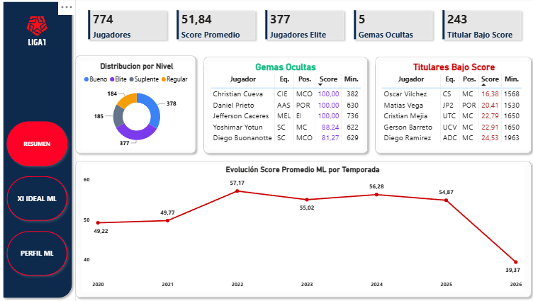
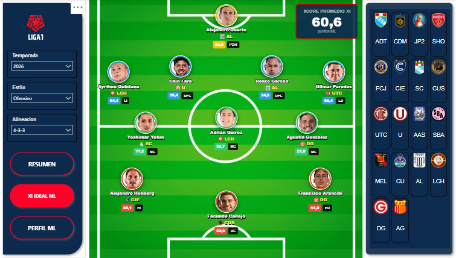
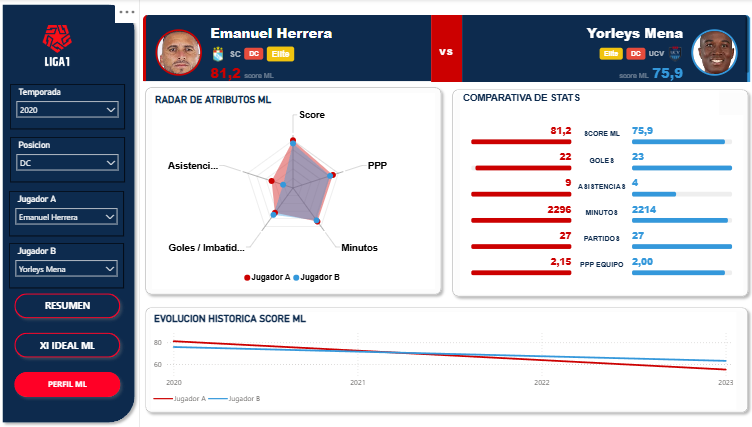

# Liga 1 Perú — Data Engineering Platform

Plataforma de datos end-to-end que extrae, procesa y expone estadísticas históricas de la **Liga 1 Peruana de Fútbol** (2020–2026) en dashboards interactivos de Power BI, con una capa de Machine Learning para scoring y clasificación de jugadores.

**Stack:** Python · Selenium · Azure Data Factory · Databricks · Delta Lake · Unity Catalog · Delta Sharing · Azure SQL · Power BI · PCA · K-means

---

## ¿Qué preguntas responde este proyecto?

**Análisis histórico (Modelo Analítico):**
- ¿Cómo ha evolucionado el rendimiento de cada equipo temporada a temporada desde 2020?
- ¿Qué equipo ha dominado la Liga 1 en los últimos años y con qué consistencia?
- ¿Cuál es el valor de mercado de los planteles peruanos y cómo ha variado en el tiempo?
- ¿Cómo se comparan los estadísticos de partido (posesión, tiros, pases, duelos) entre equipos?
- ¿Qué entrenadores han tenido mayor impacto y cuánto tiempo permanecen en los clubes?
- ¿Quién sería el XI ideal de la Liga 1 por temporada, formación y estilo táctico?

**Scouting con ML (Scouting ML):**
- ¿Qué jugadores tienen el mejor score ML por posición y temporada?
- ¿Quiénes son las gemas ocultas con alto rendimiento pero poca exposición?
- ¿Qué jugadores titulares están rindiendo por debajo de lo esperado?
- ¿Cómo se comparan dos jugadores en todas sus métricas clave?
- ¿Cuál sería el XI ideal según el modelo ML por formación y estilo de juego?
- ¿Cómo ha evolucionado el score ML de un jugador a lo largo de las temporadas?

---

## Arquitectura


El flujo completo va de la web al dashboard sin intervención manual:

```
FotMob + Transfermarkt
        │  Selenium (GitHub Actions)
        ▼
   Landing ADLS          ← 10 archivos JSON/CSV por año
        │  GitHub Actions → ADF REST API
        ▼
   RDV — Parquet         ← Curación y normalización (4 notebooks)
        │  Azure Data Factory
        ▼
   UDV — Delta Lake      ← Integración multi-fuente, lógica de negocio (13 entidades)
        │  Databricks PySpark                    │  Notebook ML (manual)
        ▼                                        ▼
   DDV — Delta Lake      ← Agregaciones para BI (8 entidades) + ft_score_ml (ML)
        │  Connector Databricks                  │  Delta Sharing
        ▼                                        ▼
   Power BI Modelo Analítico                Power BI Scouting ML
   8 dashboards · 16 tablas · 107 DAX       3 páginas · score PCA · K-means
```

**Plano de control:** Azure SQL centraliza parametrización, rutas, logs de ejecución y calidad — 44 unidades registradas, 10 Stored Procedures, metadata-driven por YAML.

---

## Dashboards

### Power BI — Modelo Analítico (`Liga 1 Perú - Modelo Analítico v2.pbip`)

### RESUMEN — Hub de navegación
KPIs globales del proyecto: temporadas, partidos, equipos, último campeón y valor total de planteles en soles peruanos.


---

### POSICIONES — Tabla histórica
Clasificaciones Apertura, Clausura y General filtradas por temporada. Datos de FotMob desde 2020.


---

### RENDIMIENTO — Análisis por equipo
Evolución histórica de PJ, PG, PE, PP, GF y GC por equipo. Comparativa entre temporadas.


---

### PARTIDOS — Estadísticas detalladas
Exploración de 2030+ partidos con 80 métricas por partido: posesión, tiros, pases, duelos, tarjetas. Datos de FotMob.


---

### PLANTILLAS — Evolución de planteles
Jugadores por equipo y temporada: posiciones, edades, extranjeros, valor de mercado. Fuente: Transfermarkt.


---

### ENTRENADORES — Cuerpos técnicos
Historial de entrenadores por equipo: período en el cargo, temporadas dirigidas y resultados.


---

### VALORACIÓN — Mercado de pases
Evolución del valor de plantel en EUR y PEN (tipo de cambio editable). Comparativa entre equipos y temporadas. Fuente: Transfermarkt.


---

### XI IDEAL — Alineación óptima
Selección algorítmica del mejor jugador por posición táctica, formación y estilo de juego. Score calculado con ponderaciones por posición (goles, asistencias, minutos, PPP, disciplina). Renderizado como campo de fútbol HTML con tooltips interactivos.


---

### Power BI — Scouting ML (`Liga 1 Perú - Scouting ML.pbix`)

Dashboard independiente conectado a `ft_score_ml` vía **Delta Sharing**. El modelo asigna a cada jugador un score (0-100) combinando automáticamente sus estadísticas más relevantes según su posición — un método estadístico que reduce múltiples métricas a un único número de rendimiento (PCA). Luego agrupa a los jugadores en 4 niveles de forma automática sin umbrales fijos (K-means): Elite, Bueno, Regular y Suplente.

### RESUMEN — Vista global del modelo ML
Panorama completo de los 774 jugadores analizados: distribución por nivel de rendimiento, gemas ocultas (jugadores con alto score pero pocos minutos — alto potencial sin exposición), titulares con score bajo, y evolución del nivel promedio de la liga por temporada.



---

### XI IDEAL ML — Alineación según score ML
El mejor jugador por posición táctica según el score del modelo. Filtros por temporada, formación y estilo de juego. Renderizado como campo de fútbol HTML con foto, equipo y score de cada jugador, más el score promedio del XI completo.



---

### PERFIL ML — Comparativa jugador vs jugador
Comparación detallada entre dos jugadores de la misma posición: header con foto, nivel y score; barras comparativas de estadísticas; radar de cinco atributos normalizados; y evolución histórica del score por temporada. Jugador B se selecciona de forma independiente al Jugador A para no interferir con los demás filtros.



---

## Datos del proyecto

| Métrica | Valor |
|---|---|
| Temporadas cubiertas | 2020 – 2026 |
| Archivos fuente por año | 10 (5 JSON FotMob + 5 CSV Transfermarkt) |
| Entidades UDV | 13 (5 maestros + 8 históricos) |
| Entidades DDV | 9 (8 analíticas + ft_score_ml ML) + 10 vistas |
| Unidades de control (Azure SQL) | 44 pipelines · 10 SPs · 1 trigger |
| Proyectos Power BI | 2 (Modelo Analítico + Scouting ML) |
| Dashboards Power BI (Modelo Analítico) | 8 · 16 tablas · 107 medidas DAX |
| Dashboards Power BI (Scouting ML) | 3 páginas · 774 jugadores · score PCA + K-means |
| Jugadores con score ML | 774 únicos · 9,651 filas (slots × temporada × posición) |

---

## Estructura del repositorio

```
liga1-azure/
│
│  ── CI/CD ──────────────────────────────────────────────────────
├── .github/
│   └── workflows/
│       ├── liga1-scraping.yml       ← Scraping + upload a ADLS + disparo ADF
│       ├── liga1-trigger-adf.yml    ← Disparo directo de ADF sin scraping
│       └── liga1-deploy-prod.yml    ← Deploy prod en merge a main:
│                                       ADF · SQL · Databricks · Jobs · parametría
│
│  ── PROCESO — ETL completo + ADF ──────────────────────────────
├── proceso/
│   ├── adf/                    ← Azure Data Factory (29 pipelines · 4 LS · 5 datasets)
│   │   ├── factory/            ← Definición del recurso ADF
│   │   ├── linkedService/      ← Conexiones: ADLS, Key Vault, Databricks, SQL
│   │   ├── dataset/            ← Formatos: JSON, CSV, Parquet, SQL
│   │   └── pipeline/           ← 29 pipelines orquestadores e hijos
│   ├── frm_landing/            ← Scripts de scraping Python (Selenium + BeautifulSoup)
│   ├── frm_rdv/                ← Notebooks RDV: curación Landing → Parquet
│   │   ├── curated_json/       ← Procesa JSON de FotMob
│   │   ├── curated_csv/        ← Procesa CSV de Transfermarkt
│   │   ├── curated_dataentry/  ← Data entry manual (catálogo de equipos)
│   │   └── curated_historico/  ← Modo bulk: reprocesa un año completo
│   ├── frm_udv/                ← Notebooks UDV: integración multi-fuente, lógica de negocio
│   │   ├── notebooks/          ← Un notebook por entidad (md_* y hm_*)
│   │   └── conf/               ← YAMLs de configuración por entidad
│   ├── frm_ddv/                ← Notebooks DDV: agregaciones para BI
│   │   ├── notebooks/          ← Un notebook por data mart (dm_* y ft_*)
│   │   └── conf/               ← YAMLs de configuración por entidad
│   ├── frm_ml/                 ← Notebooks ML: PCA + K-means por posición
│   │   └── notebooks/ft_score_ml/
│   │       ├── ft_score_ml.py      ← Lógica PCA + K-means
│   │       └── nb_ft_score_ml.py   ← Notebook: lee UDV, genera score, escribe DDV
│   ├── workflow_deploy/        ← Definición de Jobs Databricks para deploy a prod
│   │   ├── sch_udv_liga1/      ← Job UDV completo
│   │   ├── sch_ddv_liga1/      ← Job DDV completo
│   │   ├── sch_md_catalogo_equipos/ ← Job data entry catálogo
│   │   ├── sch_ml_liga1/       ← Job ML (PCA + K-means)
│   │   └── execute_jobddl/     ← Job DDL executor
│   ├── util/
│   │   └── utils_liga1.py      ← Librería PySpark compartida (Delta, SQL, flags, logging)
│   ├── cluster/
│   │   └── cluster-scraping-liga1.json ← Config cluster Databricks
│   ├── tools/
│   │   ├── build_wheel.py          ← Compila wheel de liga1_utils
│   │   └── nb_export_ddv_csv.py    ← Exporta tablas DDV a CSV
│   └── setup.py                ← Empaqueta utils_liga1 como wheel (liga1_utils)
│
│  ── PREP AMBIENTE ──────────────────────────────────────────────
├── PrepAmb/
│   ├── 01_crear_catalog_schemas.sql ← CREATE CATALOG · schemas · Volume en Unity Catalog
│   ├── Querys.sql              ← DDL plano de control Azure SQL: tablas, SPs, seed data
│   ├── crear_recursos_prod.sh  ← Script Azure CLI: crea todos los recursos prod en un shot
│   └── ddl_deploy/             ← DDL de tablas Delta y vistas por entidad
│       ├── ddl_{entidad}/      ← CREATE TABLE + CREATE VIEW por entidad DDV/UDV
│       ├── ddl_ft_score_ml/    ← DDL ft_score_ml + vista Delta Sharing
│       ├── ddl_vista/          ← Vistas transversales DDV (rendimiento, posiciones, slots)
│       │   └── ddl_vistas_ddv.sql  ← SQL extraído del notebook de vistas
│       ├── crear_esquema_ddv.py
│       └── crear_esquema_udv.py
│
│  ── DASHBOARD ───────────────────────────────────────────────────
├── dashboard/
│   ├── Liga 1 Perú - Modelo Analítico v2.pbip    ← Modelo analítico (8 dashboards, PBIP)
│   ├── Liga 1 Perú - Modelo Analítico v2.Report/ ← Páginas del reporte
│   ├── Liga 1 Perú - Modelo Analítico v2.SemanticModel/ ← Tablas y medidas DAX
│   ├── Liga 1 Perú - Scouting ML.pbix            ← Scouting ML (3 páginas · Delta Sharing)
│   ├── Liga1_Theme.json        ← Tema de marca: paleta y tipografía
│   └── img/                    ← Imágenes embebidas (logos, fondos, cancha)
│
│  ── DATASETS ────────────────────────────────────────────────────
├── datasets/                   ← Muestra representativa de archivos fuente
│   └── {año}/                  ← JSON de FotMob + CSV de Transfermarkt por temporada
│
│  ── REVERSIÓN ───────────────────────────────────────────────────
├── reversion/
│   └── drop_all_objects.sql    ← DROP de todas las vistas, tablas, schemas y catálogo
│
│  ── SEGURIDAD ───────────────────────────────────────────────────
├── seguridad/
│   └── grants_unity_catalog.sql ← GRANTS por grupo: data-readers, data-analysts, adf-sp
│
│  ── CERTIFICACIONES Y EVIDENCIAS ───────────────────────────────
├── certificaciones/            ← Capturas de certificaciones Azure / Databricks
├── evidencias/                 ← Capturas del deploy prod ejecutando en GitHub Actions
│
│  ── DOCUMENTACIÓN ──────────────────────────────────────────────
├── docs/
│   ├── 01_arquitectura_tecnica.md
│   ├── 02_catalogo_entidades.md
│   ├── 03_powerbi_dashboards.md
│   ├── 04_scouting_ml.md
│   └── 05_guia_despliegue.md
└── README.md
```

---

## Documentación

| Documento | Contenido |
|---|---|
| [Arquitectura y Funcionamiento](./docs/01_arquitectura_tecnica.md) | Stack, capas, CI/CD, plano de control, seguridad, capa ML, Delta Sharing |
| [Catálogo de Entidades](./docs/02_catalogo_entidades.md) | Diccionario de datos: todas las tablas, columnas y relaciones, incluye ft_score_ml |
| [Power BI & Dashboards](./docs/03_powerbi_dashboards.md) | Modelo semántico, medidas DAX, 8 dashboards del Modelo Analítico, flujo Git |
| [Scouting ML](./docs/04_scouting_ml.md) | ft_score_ml, Delta Sharing, dashboard Scouting ML: páginas, medidas DAX, tablas calculadas |
| [Guía de Despliegue](./docs/05_guia_despliegue.md) | Paso a paso para reproducir la arquitectura desde cero, incluye despliegue ML |

---

*Desarrollado por Oscar García Del Águila — Lima, Perú · 2025–2026*
