# Arquitectura y Funcionamiento — Liga 1 Perú Data Platform

**Proyecto:** Liga 1 Perú — Data Engineering en Azure  
**Autor:** Oscar García Del Águila  
**Fecha:** Junio 2026  
**Estado:** Landing, RDV, UDV, DDV y Power BI implementadas  
**Estilo arquitectónico:** Lakehouse Medallion Extendida sobre Azure

---

## Tabla de Contenidos

- [Resumen Ejecutivo](#resumen-ejecutivo)
- [Estilo Arquitectónico](#estilo-arquitectónico)
- [Diagrama de Arquitectura General](#diagrama-de-arquitectura-general)
- [Componentes del Stack](#componentes-del-stack)
- [Capas del Data Lake](#capas-del-data-lake)
- [Plano de Control](#plano-de-control)
- [Seguridad y Accesos](#seguridad-y-accesos)
- [CI/CD y Automatización](#cicd-y-automatización)
- [Configuración del Clúster Databricks](#configuración-del-clúster-databricks)
- [Capa de Consumo — Power BI](#capa-de-consumo--power-bi)

---

## Resumen Ejecutivo

Plataforma de datos end-to-end construida sobre Microsoft Azure que extrae estadísticas de la Liga 1 Peruana desde FotMob y Transfermarkt, las procesa en cinco capas (Landing → RDV → UDV → DDV → Power BI) y las expone en 8 dashboards interactivos.

La arquitectura sigue el patrón **Medallion** (Bronze → Silver → Gold) con extensiones que la hacen más robusta:

| Extensión | Qué significa en la práctica |
|---|---|
| **Configuración centralizada** | Cada entidad tiene un archivo YAML que define su esquema, columnas y reglas. ADF y Databricks leen ese YAML — ningún pipeline tiene valores fijos en el código. |
| **Tablas maestras entre fuentes** | FotMob y Transfermarkt usan IDs distintos para los mismos equipos. Las tablas `md_*` actúan como diccionario: "el equipo X de FotMob es el mismo equipo Y de Transfermarkt". |
| **Merge/overwrite con reproceso** | Los datos se pueden reprocesar por año sin borrar todo — el pipeline detecta qué cambió y solo actualiza esos registros. |
| **Governance con Unity Catalog** | Los datos están organizados en catálogos y schemas con permisos. No es una carpeta suelta en ADLS. |
| **Trazabilidad operacional** | Cada ejecución queda registrada con inicio, fin, estado y registros procesados. Si algo falla, se sabe exactamente en qué entidad y en qué paso. |
| **Carga en paralelo** | ADF puede procesar varios años de datos al mismo tiempo, no uno por uno. |

**Lo que NO es esta arquitectura:**
- **No es Kimball/Star Schema:** no hay tablas de dimensiones y hechos en el sentido clásico del data warehousing.
- **No es Data Vault:** no usa la estructura de hubs, links y satélites.
- **La capa UDV no es solo limpieza:** integra y homologa datos de dos fuentes distintas con lógica de negocio.

---

## Diagrama de Arquitectura General

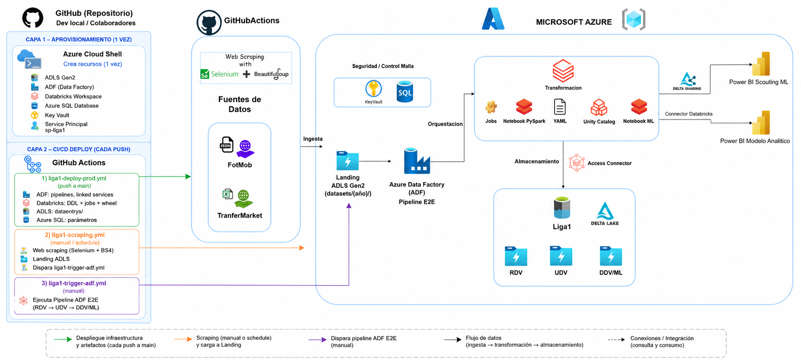

El diagrama muestra la arquitectura completa incluyendo la capa de despliegue a producción. Hay dos capas previas al flujo de datos:

**Capa 1 — Aprovisionamiento (una sola vez):** Azure Cloud Shell crea todos los recursos de infraestructura prod: ADLS Gen2 (`datalakelig1peruprod`), ADF, Databricks Workspace, Azure SQL, Key Vault y el Service Principal `sp-liga1`.

**Capa 2 — CI/CD Deploy (cada push a main):** Tres workflows de GitHub Actions orquestan el despliegue de componentes desde el repositorio: `liga1-deploy-prod.yml` despliega ADF (linked services, pipelines), Databricks (catalog, DDL de tablas y vistas, jobs, wheel de utils) y sube archivos estáticos a ADLS; `liga1-scraping.yml` ejecuta el web scraping con Selenium + BeautifulSoup para FotMob y Transfermarkt, sube los archivos al landing de ADLS y dispara el pipeline ADF E2E; `liga1-trigger-adf.yml` permite disparar el pipeline ADF manualmente.

**Flujo de datos:** FotMob + Transfermarkt → Landing ADLS Gen2 → Pipeline ADF E2E → Databricks (Jobs PySpark + Notebooks + Unity Catalog) → ADLS Delta Lake (RDV / UDV / DDV-ML) → Power BI (Delta Sharing para Scouting ML + Connector Databricks para Modelo Analítico), con Key Vault y Azure SQL como plano de control transversal.

---

## Componentes del Stack

| Componente | Tecnología | Versión / Detalle |
|---|---|---|
| **Ingesta de datos** | Selenium + BeautifulSoup + Python | Python 3.x · scraping FotMob (JSON) y Transfermarkt (CSV) |
| **Almacenamiento** | Azure Data Lake Storage Gen2 (`datalakelig1peru`, contenedor `liga1`) | Hierarchical Namespace habilitado |
| **Orquestación** | Azure Data Factory (`adf-ligafutbol`) | Disparado por GitHub Actions via REST API · 29 pipelines · 4 linked services |
| **Procesamiento** | Databricks workspace `dbw-liga1` + PySpark + Delta Lake | Runtime 15.4 LTS · Spark 3.5 · Scala 2.12 |
| **Plano de control** | Azure SQL Database (`serverfutbol.database.windows.net` / `ligafutbol`, user `adminliga1`) | Schema `control` · tablas de parametrización, paths, ejecuciones y calidad |
| **Gestión de secretos** | Azure Key Vault (`kv-liga1-secreto`) | Account Key ADLS, PAT Databricks, credenciales SQL · Secret scope `secretliga1` |
| **Gobernanza** | Unity Catalog (Databricks) — catalog `catalog_liga1` | Tablas Delta + vistas UDV/DDV · External location `ext-loc-datalakelig1peru` · Storage credential `sc-datalakelig1peru` · Access Connector `acc-liga1` (Managed Identity) |
| **CI/CD** | GitHub Actions | 4 modos de ejecución · workflows `liga1-scraping.yml` y `liga1-trigger-adf.yml` |
| **Machine Learning** | Python · scikit-learn (PCA + K-means) | Notebook Databricks manual · PCA por posición sobre stats normalizadas · K-means 4 clusters (Elite/Bueno/Regular/Suplente) · resultado en `ft_score_ml` (DDV) |
| **Delta Sharing** | Unity Catalog Delta Sharing | Expone `ft_score_ml_vw` al conector Power BI Scouting ML sin mover datos fuera de Databricks |
| **Visualización** | Power BI | Dos proyectos: Modelo Analítico en formato PBIP (Import · SQL Warehouse · 16 tablas · 8 dashboards · versionado en Git) y Scouting ML en formato PBIX (Delta Sharing · ft_score_ml · 3 páginas) |
| **Control de versiones** | Git + GitHub | Repo `oscarmilan30/liga1-azure` · Branch `test-construccion` (desarrollo, migrará a `main`) · `adf_publish` para ADF publicado |

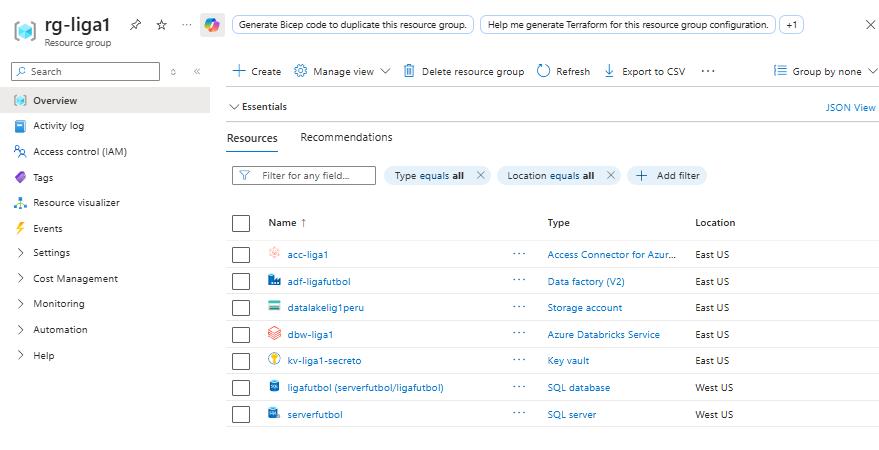

### Linked Services ADF (4 total)

| Linked Service | Tipo | Autenticación | Uso |
|---|---|---|---|
| `ls_azure_keyvault` | Azure Key Vault | Managed Identity del ADF | Fuente de secretos para todos los demás LS |
| `ls_adls` | Azure Blob FS (ADLS Gen2) | Account Key via KV → secreto `storageaccountkey` | Lectura/escritura de archivos Landing y RDV |
| `ls_databricks` | Azure Databricks | Token PAT via KV → secreto `databricks-token` | Ejecución de notebooks/jobs Databricks (parametrizado con CLUSTER_ID y AREA) |
| `ls_sql_liga1` | Azure SQL Database | SQL Auth via KV → secreto `kv-sql-password` | Lectura/escritura del plano de control (`ligafutbol`) |

### Datasets ADF (6 total)

| Dataset | Formato | Linked Service | Uso |
|---|---|---|---|
| `ds_adls_binary` | Binary | `ls_adls` | Copia de archivos sin transformación (marker files) |
| `ds_adls_csv` | DelimitedText | `ls_adls` | Archivos CSV de Transfermarkt en Landing |
| `ds_adls_csv_dataentry` | DelimitedText | `ls_adls` | CSVs de catálogos manuales (data entry) |
| `ds_adls_json` | JSON | `ls_adls` | Archivos JSON de FotMob en Landing |
| `ds_adls_parquet` | Parquet | `ls_adls` | Archivos Parquet en capa RAW |
| `ds_sql_generic` | AzureSqlTable | `ls_sql_liga1` | Lectura/escritura genérica del plano de control SQL |

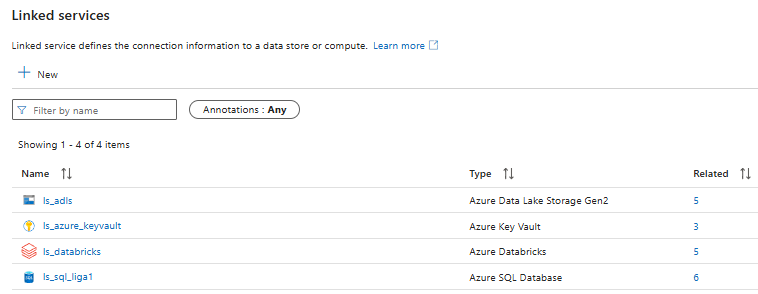

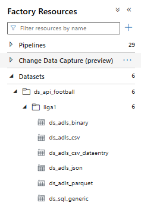

### Por qué estas tecnologías

**GitHub Actions para el scraping** — el scraper necesita Chrome/Selenium para renderizar páginas JavaScript de FotMob. GitHub Actions ofrece runners Ubuntu con soporte nativo para `setup-chrome`, ejecución programada (`schedule`) y acceso a secretos cifrados. Es la opción con menor fricción operacional y cero costo de infraestructura para un job que corre semanalmente.

**Azure Data Factory para orquestación** — ADF centraliza el control de ejecución con triggers, retry automático, monitoring nativo en Azure y parametrización dinámica. Alternativas como Airflow requerirían infraestructura adicional. ADF integra nativamente con Databricks (via Linked Service) y con GitHub Actions (via REST API).

**Azure Databricks para procesamiento** — Delta Lake es el formato de almacenamiento central; Databricks es su motor nativo. Unity Catalog proporciona gobernanza de datos a nivel de columna y linaje automático. Para el volumen actual el procesamiento en modo Single Node es suficiente, pero la arquitectura escala a múltiples workers sin cambios de código.

**Power BI en modo Import** — los datos se importan desde Databricks SQL Warehouse al modelo semántico. El refresh se ejecuta manualmente o puede programarse. El formato PBIP (vs .pbix) permite versionar todos los artefactos en Git y editar medidas DAX directamente en el repositorio.

---

## Capas del Data Lake

### Landing — Archivos crudos del scraping

- **Cuenta ADLS:** `datalakelig1peru` · Contenedor: `liga1`
- **Ruta ADLS:** `landing/archivos_scraping/{yyyy}/`
- **Formato:** JSON (FotMob) y CSV (Transfermarkt)
- **Trigger:** Al terminar el scraping, GitHub Actions llama directamente a la REST API de ADF para lanzar el pipeline. No hay Storage Event Trigger en ADF.
- **10 archivos por año:**

| Fuente | Archivo | Formato |
|---|---|---|
| FotMob | `equipos_{año}.json` | JSON |
| FotMob | `partidos_{año}.json` | JSON |
| FotMob | `estadisticas_partidos_{año}.json` | JSON |
| FotMob | `tablas_clasificacion_{año}.json` | JSON |
| FotMob | `campeones_{año}.json` | JSON |
| Transfermarkt | `liga1_{año}.csv` (valoraciones) | CSV |
| Transfermarkt | `plantillas_{año}.csv` | CSV |
| Transfermarkt | `estadios_{año}.csv` | CSV |
| Transfermarkt | `entrenadores_{año}.csv` | CSV |
| Transfermarkt | `estadisticas_jugadores_{año}.csv` | CSV |

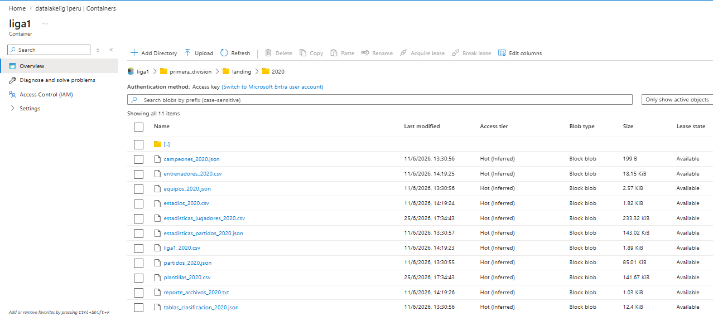

### RDV / Bronze — Curación y normalización

- **Equivalente Medallion:** Bronze
- **Nombre interno del proyecto:** RDV (Raw Data View)
- **Rol:** Limpieza ligera, tipificación, normalización básica y consolidación histórica. Mínima lógica de negocio; preserva trazabilidad y desacopla ingesta de integración.
- **Ruta ADLS:** `primera_division/rdv/{entidad}/{yyyy}/{MM}/{dd}/data/`
  - `RUTA_BASE='primera_division'` — prefijo común para todas las capas
- **Formato:** Parquet particionado por fecha
- **4 notebooks de curación** (carpeta `proceso/frm_rdv/`):
  - `curated_json`: parseo y aplanado de JSONs de FotMob
  - `curated_csv`: limpieza de CSVs de Transfermarkt (valores monetarios, decimales europeos)
  - `curated_historico`: unificación de datos multi-año — primera carga completa (1FL)
  - `curated_dataentry`: ingesta de catálogos manuales de referencia
- **Registro:** Cada Parquet generado se registra en `tbl_paths` con `flg_udv = 'N'`

### UDV / Silver — Capa semántica de integración

- **Equivalente Medallion:** Silver extendida
- **Nombre interno del proyecto:** UDV (Unified Data View)
- **Ruta ADLS:** `primera_division/udv/{entidad}/data/` · Ejemplo: `primera_division/udv/hm_campeones/data/`
- **Rol:** Esta es la capa más importante. No es un Silver de limpieza simple; integra y homologa datos de dos fuentes distintas (FotMob y Transfermarkt) en un modelo único y coherente.
  - Las tablas `md_*` son **tablas maestras de referencia**: resuelven el problema de que FotMob y Transfermarkt usan IDs distintos para los mismos equipos y jugadores. Actúan como diccionario entre fuentes.
  - Las tablas `hm_*` almacenan el histórico por temporada con su evolución en el tiempo.
- **Formato:** Delta Lake (Unity Catalog)
- **Estrategias de carga:** `merge` (actualiza registros existentes e inserta nuevos) u `overwrite` (reemplaza la partición completa). Ambas implementadas en `utils_liga1.py → write_delta_udv()`.
- **Configuración:** YAML por entidad en `proceso/frm_udv/conf/` — esquema, columnas, reglas de transformación y condiciones de merge
- **Exposición:** Vistas SQL (`vw_udv.*`) para exploración por data engineers · Power BI consume solo `vw_ddv.*`
- **13 entidades UDV:** 5 maestros (`md_`) + 8 históricos (`hm_`)

| Tipo | Entidades |
|---|---|
| Maestros `md_` | `md_catalogo_equipos`, `md_equipos`, `md_estadios`, `md_plantillas` *(creado por `hm_plantillas_equipo`)*, `md_entrenadores` *(creado por `hm_entrenadores_equipo`)* |
| Históricos `hm_` | `hm_campeones`, `hm_entrenadores_equipo`, `hm_estadisticas_jugadores`, `hm_estadisticas_partidos`, `hm_partidos`, `hm_plantillas_equipo`, `hm_tablas_clasificacion`, `hm_valoracion_equipos` |

### DDV / Gold — Data Marts y Semantic Layer

- **Equivalente Medallion:** Gold
- **Nombre interno del proyecto:** DDV (Dimensional Data View)
- **Ruta ADLS:** `primera_division/ddv/{entidad}/data/` · Ejemplo: `primera_division/ddv/dm_equipos/data/`
- **Rol:** Agrega, desnormaliza y expone los datos en formato analítico listo para Power BI. No contiene lógica de integración — eso ya lo resolvió la UDV.
- **8 entidades DDV:** todas implementadas con notebook PySpark, YAML de configuración y DDL en `PrepAmb/ddl_deploy/`

| Entidad | Descripción |
|---|---|
| `dm_equipos` | Dimensión de equipos (nombre, alias, logo FotMob, estadio) |
| `ft_rendimiento_temporada` | PJ, PG, PE, PP, GF, GC por equipo y temporada |
| `ft_rendimiento_acumulado` | Estadísticas históricas acumuladas por equipo |
| `ft_partidos_detalle` | 80+ estadísticas por partido (FotMob) |
| `ft_plantillas_historico` | Plantillas por equipo y temporada (Transfermarkt) |
| `ft_entrenadores_historico` | Cuerpos técnicos históricos |
| `ft_evolucion_valoracion` | Valoraciones de mercado en EUR (Transfermarkt) |
| `ft_estadisticas_jugadores` | Estadísticas individuales de jugadores por temporada |
| `ft_score_ml` | Score ML por jugador × temporada × posición: PCA + K-means · generado por notebook manual `proceso/frm_ml/` |

---

## Capa ML — Machine Learning sobre jugadores

La capa ML **forma parte del pipeline ADF E2E** (`pl_Orchestrator_E2E_liga1`). Se ejecuta automáticamente después de la capa DDV, orquestada por el pipeline `pl_Orchestrator_ligaperuana_ml`, que lanza el Databricks Job `sch_ml_liga1`.

El flujo completo del E2E es:

```
raw → dataentrys → udv → (fix si HISTORICO) → ddv → ml → fin
```

### Proceso ML

```
ft_estadisticas_jugadores (DDV) + ft_plantillas_historico (DDV)
        │  ADF E2E → pl_Orchestrator_ligaperuana_ml → sch_ml_liga1 (Databricks Job)
        │  nb_ft_score_ml.py + ft_score_ml.py
        ▼
   PCA por posición         ← Reduce múltiples estadísticas a un solo componente
        │                      principal por posición (goles/90, asistencias/90,
        │                      ppp, minutos, tarjetas; para POR: imbatidos y GC)
        ▼
   score_ml (PC1)           ← Score bruto centrado en 0 por posición
        │  Normalización 0-100 dentro de la posición
        ▼
   score_100                ← Score final (0=peor en su posición, 100=mejor)
        │  K-means (k=4) sobre score_100
        ▼
   nivel                    ← Elite · Bueno · Regular · Suplente
        │  Escribe a catalog_liga1.tb_ddv.ft_score_ml
        ▼
   ft_score_ml_vw (vw_ddv)  ← Vista DDV expuesta via Delta Sharing
```

### Delta Sharing

`ft_score_ml_vw` se expone como un **Delta Share** en Unity Catalog (`nb_delta_sharing.py`). Power BI Scouting ML se conecta como receptor (recipient) del share sin copiar datos a ningún sistema externo. El share se actualiza automáticamente cada vez que se regenera `ft_score_ml`.

| Concepto | Valor |
|---|---|
| Share | `liga1_scouting` |
| Tabla compartida | `catalog_liga1.vw_ddv.ft_score_ml_vw` |
| Script de configuración | `PrepAmb/PrepAmb/ddl_deploy/nb_delta_sharing.py` |
| Conector Power BI | Delta Sharing (Power BI Connector for Databricks) |

Para documentación completa del dashboard Scouting ML ver [04 · Scouting ML](./04_scouting_ml.md).

---

## Plano de Control

El plano de control en Azure SQL centraliza toda la parametrización operacional:

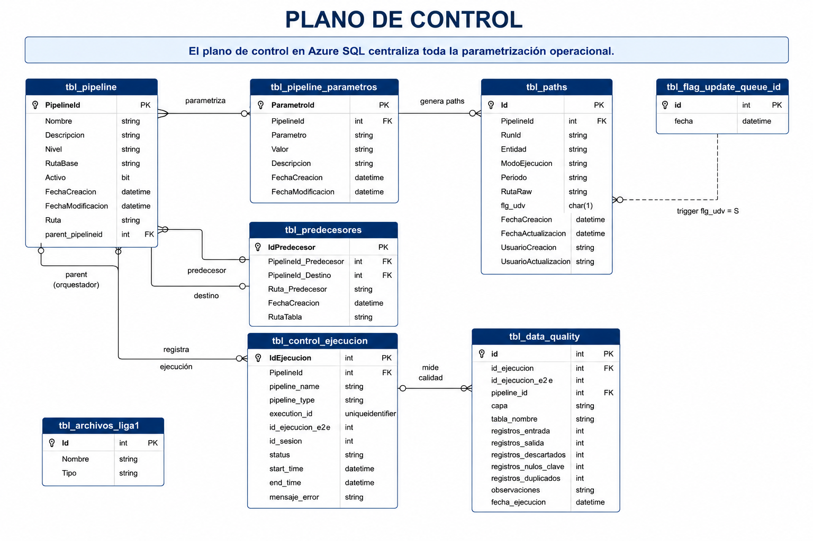

**Tablas — descripción completa:**

| Tabla | Rol |
|---|---|
| `tbl_pipeline` | Catálogo de **44 pipelines** registrados. `Nivel` = RDV / UDV / DDV / FIX / E2E / DATAENTRY. `parent_pipelineid` vincula workflows Databricks con su orquestador ADF. `Ruta` = ruta ADLS destino de la tabla. |
| `tbl_pipeline_parametros` | Parámetros por pipeline (clave-valor): `RUTA_BASE`, `FILESYSTEM`, `YAML_PATH`, `JOB_ID`, `TIPO_CARGA`, `NOMBRE_TABLA`, `SCHEMA_TABLA`, `MODO_EJECUCION`, etc. ADF y los notebooks leen de aquí vía `sp_obtener_parametros`. |
| `tbl_paths` | Registro de cada Parquet generado en RDV. `flg_udv` = `N` (pendiente) / `S` (procesado). `ModoEjecucion` y `Periodo` permiten filtrar qué reprocesar. `FechaActualizacion` y usuarios auditables. |
| `tbl_predecesores` | DAG de dependencias entre pipelines. Determina el orden de ejecución. Poblada por `sp_registrar_predecesor`. `RutaTabla` = schema lógico del predecesor (ej. `tb_udv.md_catalogo_equipos`). |
| `tbl_control_ejecucion` | Auditoría de ejecuciones: `status` = Running/Success/Failed/CANCELLED. `id_ejecucion_e2e` agrupa todos los pipelines de un run completo. `id_sesion` = `IdEjecucion` del orquestador E2E padre. |
| `tbl_data_quality` | Métricas de calidad por capa y tabla: registros entrada/salida, descartados, nulos en clave, duplicados. Se registra al final de cada notebook UDV/DDV. |
| `tbl_archivos_liga1` | Catálogo de los **10 archivos fuente** (5 JSON FotMob + 5 CSV Transfermarkt). Leído por `sp_obtener_archivos` para que el scraper sepa qué generar. |
| `tbl_flag_update_queue_id` | Tabla trigger: al insertar un `id`, el trigger `trg_update_tbl_paths_by_id` actualiza `flg_udv='S'` en `tbl_paths`. Evita UPDATE directo desde notebooks. |

**Stored Procedures:**

| SP | Función |
|---|---|
| `sp_log_start` | Inserta registro en `tbl_control_ejecucion` con status `Running`. Retorna `IdEjecucion`. |
| `sp_log_end` | Actualiza estado final (Success/Failed) y `end_time` en `tbl_control_ejecucion`. |
| `sp_obtener_parametros` | Pivota los parámetros de un pipeline de rows a columnas. ADF lo llama para leer la config de cada entidad. |
| `sp_registrar_path` | Inserta en `tbl_paths` (modo INCREMENTAL/REPROCESO). Modo HISTORICO lo maneja el SP separado. |
| `sp_registrar_path_historico` | MERGE en `tbl_paths` para modo HISTORICO: actualiza si ya existe la ruta, inserta si no. |
| `sp_registrar_predecesor` | Inserta relación en `tbl_predecesores`. Lee `Ruta` y `SCHEMA_TABLA`+`NOMBRE_TABLA` del pipeline predecesor para construir `RutaTabla`. |
| `sp_obtener_archivos` | Retorna JSON con los 10 archivos fuente desde `tbl_archivos_liga1`. Usado por el scraper. |
| `sp_obtener_rango_anios` | Genera rango de años (CTE recursiva) para carga histórica. |
| `sp_cancelar_ejecuciones_huerfanas` | Cancela ejecuciones en status `Running` que llevan más de N minutos (default 30). Limpieza al inicio de nuevos runs. |
| `sp_actualizar_modo_ejecucion` | Resetea `MODO_EJECUCION='INCREMENTAL'` y `FLG_REPROCESO='0'` tras un reproceso. |

**Pipelines registrados en `tbl_pipeline` (44 total):**

> **Nota:** Los 44 son entradas en la tabla de control Azure SQL — incluyen tanto pipelines ADF (29 definiciones JSON en `pipeline/`) como referencias a Databricks Jobs registrados para trazabilidad. No son 44 archivos JSON de ADF.

| Nivel | Pipelines |
|---|---|
| RDV (curación) | `Rdv_Liga1` (orquestador), `catalogo_equipos`, `plantillas`, `entrenadores`, `liga1`, `partidos`, `estadisticas_partidos`, `tablas_clasificacion`, `campeones`, `estadisticas_jugadores`, `posiciones` (dataentry), `nacionalidades` (dataentry) |
| UDV (transformación) | `md_catalogo_equipos`, `md_equipos`, `md_estadios`, `md_plantillas`, `md_entrenadores`, `hm_plantillas_equipo`, `hm_entrenadores_equipo`, `hm_valoracion_equipos`, `hm_partidos`, `hm_estadisticas_partidos`, `hm_tablas_clasificacion`, `hm_campeones`, `hm_estadisticas_jugadores` + orquestadores `pl_Orchestrator_ligaperuana_udv`, `sch_ligaperuana_udv` |
| DDV (agregación) | `dm_equipos`, `ft_rendimiento_temporada`, `ft_rendimiento_acumulado`, `ft_partidos_detalle`, `ft_plantillas_historico`, `ft_entrenadores_historico`, `ft_evolucion_valoracion`, `ft_estadisticas_jugadores` + orquestadores `pl_Orchestrator_ligaperuana_ddv`, `sch_ddv_liga1` |
| FIX | `pl_Orchestrator_fix`, `pl_fix_plantillas`, `fix_estadisticas_partidos` |
| E2E | `pl_Orchestrator_E2E_liga1` |
| DATAENTRY | `pl_Orchestrator_dataentrys` |

---

## Enmallado — Malla de Dependencias de Pipelines

El "enmallado" es el grafo de dependencias que determina el orden de ejecución de todos los pipelines. Está almacenado en `tbl_predecesores` (Azure SQL) y es consultado en tiempo de ejecución por los Databricks Jobs antes de procesar cada entidad. Si un predecesor no está completo (`flg_udv ≠ 'S'`), el pipeline espera.

### Por qué existe este mecanismo

En plataformas de datos empresariales con múltiples procesos ejecutándose en paralelo, es necesario garantizar el orden de ejecución: un proceso no puede iniciar hasta que todos sus predecesores hayan terminado correctamente. Este control se gestiona mediante tablas de matriculación donde cada proceso tiene un ID único y se registran explícitamente sus dependencias (predecesor → sucesor). Sin una malla de control, los procesos concurrentes no tienen garantía de orden y los datos pueden procesarse en un estado inconsistente. Aquí ese rol lo cumple `tbl_predecesores` en Azure SQL.

### Grafo 1 — RDV: curación y registro de paths

Muestra cómo los notebooks de curación transforman los archivos Landing en Parquet RDV y los registran en `tbl_paths` con `flg_udv='N'`.

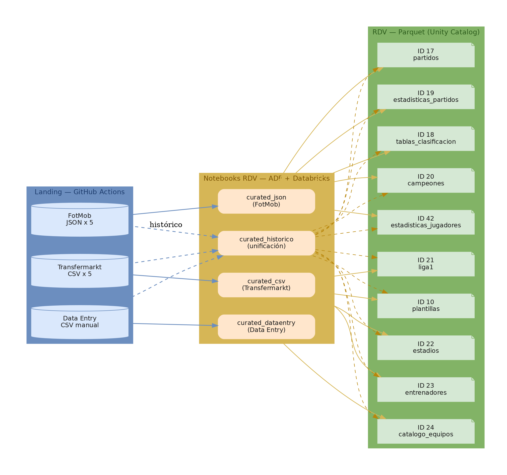

### Grafo 2 — UDV: dependencias entre entidades

Muestra el grafo de predecesores/sucesores de la capa UDV almacenado en `tbl_predecesores`. `md_catalogo_equipos` (ID 4, azul marino) es el HUB central del que dependen casi todas las entidades.

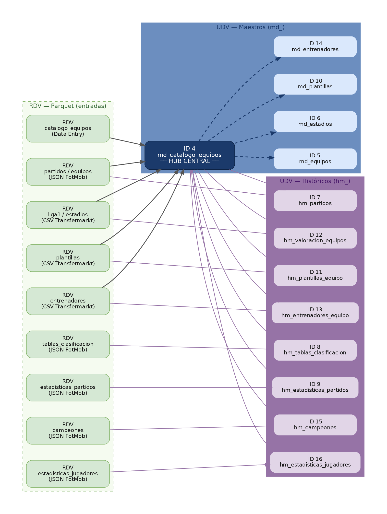

### Grafo 3 — DDV: dependencias hacia los data marts

Muestra qué entidades UDV alimentan cada data mart DDV y cómo todos convergen en Power BI vía `vw_ddv.*`.

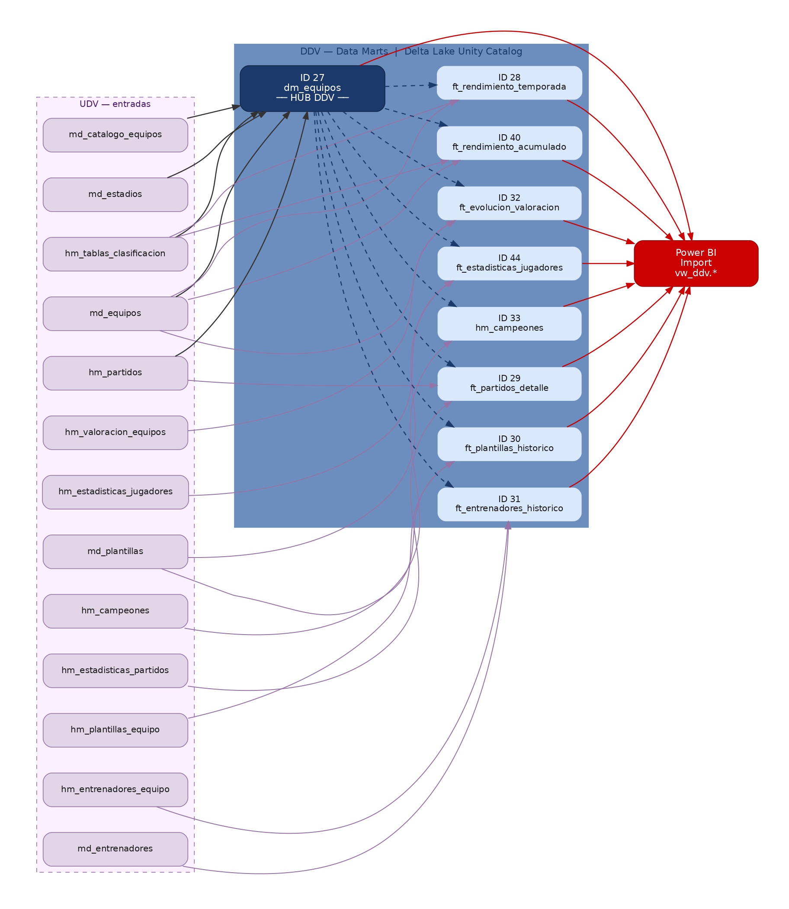

### Cómo funciona tbl_predecesores en tiempo de ejecución

1. ADF lanza `sch_udv_liga1` (Databricks Job) con los IDs de pipelines a procesar
2. Antes de ejecutar cada notebook, el Job consulta `tbl_predecesores` para obtener las rutas de las tablas predecesoras
3. Verifica en `tbl_paths` que todos los predecesores tienen `flg_udv = 'S'`
4. Si alguno está pendiente (`'N'`), el notebook espera o lanza error controlado
5. Al terminar, el trigger `trg_update_tbl_paths_by_id` en `tbl_flag_update_queue_id` marca `flg_udv = 'S'` automáticamente

```sql
-- Consulta que hace cada notebook para obtener sus predecesores
SELECT rp.Ruta, rp.SCHEMA_TABLA, rp.NOMBRE_TABLA, rp.RutaTabla
FROM   tbl_predecesores p
JOIN   tbl_pipeline     rp ON p.PipelineId_Predecesor = rp.PipelineId
WHERE  p.PipelineId_Destino = @pipeline_id
```

### Números del enmallado

| Capa | Pipelines registrados | Predecesores mínimos |
|---|---|---|
| RDV | 12 pipelines de curación | 0 (leen directo de Landing) |
| UDV | 13 entidades + 2 orquestadores | 1–3 por entidad |
| DDV | 8 entidades + 2 orquestadores | 1–2 por entidad |
| E2E / FIX | 4 | — |
| **Total** | **44 registros en tbl_pipeline** | — |

---

## Pipelines ADF — Descripción Detallada

Los 29 pipelines ADF se organizan en carpetas según su función. A continuación se describe qué hace cada uno.

### Orquestador E2E (`pl_pipelines_master`)

| Pipeline | Qué hace |
|---|---|
| `pl_Orchestrator_E2E_liga1` | **Orquestador principal del proyecto.** Ejecuta el flujo completo en orden: cancela ejecuciones huérfanas pendientes → registra inicio en Azure SQL → lanza RDV → data entries → UDV → fix condicional (solo en modo HISTORICO) → DDV → ML → registra fin. Es el único pipeline que se dispara desde GitHub Actions via REST API. |

---

### Pipelines de Control (`pl_pipeline_control`)

Pipelines reutilizables que otros pipelines invocan para registrar estado y gestionar operaciones comunes.

| Pipeline | Qué hace |
|---|---|
| `pl_ctrl_start` | Llama a `sp_log_start` en Azure SQL para registrar el inicio de una ejecución. Retorna el `IdEjecucion` que se propaga a todos los pipelines hijos para trazabilidad. |
| `pl_ctrl_end_success` | Llama a `sp_log_end` con status `Success` y registra la hora de fin en `tbl_control_ejecucion`. |
| `pl_ctrl_end_fail` | Llama a `sp_log_end` con status `Failed` y guarda el mensaje de error de la actividad que falló. |
| `pl_delete_controlado` | Elimina una carpeta o archivo de ADLS de forma segura: primero verifica que existe con `GetMetadata`, luego evalúa si debe borrarse según el modo de ejecución (no elimina en modo incremental si el archivo ya fue procesado). |
| `pl_get_csv_mapping` | Lee el header de un CSV en ADLS y construye dinámicamente el script de mapeo de columnas necesario para copiar datos con la actividad Copy de ADF. Se usa en data entries con estructura variable. |

---

### Pipelines RDV (`pl_pipelines_rdv`)

Procesan los archivos de Landing (JSON/CSV) y los convierten a Parquet en la capa RDV.

| Pipeline | Qué hace |
|---|---|
| `pl_Orchestrator_ligaperuana_Rdv` | **Orquestador de la capa RDV.** Registra inicio/fin y delega a `pl_ligaperuana_Rdv` que enruta al modo correcto. |
| `pl_ligaperuana_Rdv` | Lee parámetros de Azure SQL y evalúa el flag de reproceso. Si `FLG_REPROCESO=1` lanza modo reproceso; si no, va a incremental o histórico según `MODO_EJECUCION`. |
| `pl_ligaperuana_Incremental` | Procesa solo el año actual. Itera los 10 archivos fuente del año en curso y los curada a Parquet. |
| `pl_ligaperuana_Reproceso` | Reprocesa un año específico indicado por parámetro. Misma lógica que incremental pero para el año de reproceso. |
| `pl_ligaperuana_Historico` | Procesa el rango completo 2020 → año actual. Itera año por año y archivo por archivo, con paralelismo controlado. |
| `pl_historico_unificador` | Unifica y limpia los Parquet de un año histórico llamando al notebook `curated_historico` en Databricks. Registra la ruta en `tbl_paths` con `sp_registrar_path_historico`. |
| `pl_procesar_archivos_por_anio` | Para un año dado, verifica si existen los archivos en ADLS con `GetMetadata` e itera cada uno llamando a `pl_procesar_archivos`. |
| `pl_procesar_archivos` | Para un archivo individual: evalúa si debe procesarse (según modo y flag), lanza el notebook de curación correspondiente en Databricks y registra el Parquet generado en `tbl_paths`. |
| `pl_condition_proceso` | Evalúa la condición de modo de ejecución (INCREMENTAL / REPROCESO / HISTORICO) y dirige el flujo al branch correspondiente dentro de un `IfCondition`. |

---

### Pipelines Data Entry (`pl_pipelines_dataentrys`)

Cargan catálogos de referencia manuales que no vienen del scraping.

| Pipeline | Qué hace |
|---|---|
| `pl_Orchestrator_dataentrys` | **Orquestador de data entries.** Lanza en paralelo los tres pipelines de catálogos y registra inicio/fin. Se ejecuta después de RDV en el E2E. |
| `pl_dataentry_posiciones` | Copia el CSV de posiciones desde ADLS a la capa RDV curated_dataentry. |
| `pl_dataentry_nacionalidades` | Copia el CSV de nacionalidades desde ADLS a la capa RDV curated_dataentry. |
| `pl_dataentry_catalogo_equipos` | Copia el CSV del catálogo de equipos, construye el mapeo de columnas dinámicamente con `pl_get_csv_mapping` y lanza el notebook de curación en Databricks que ejecuta el MERGE sobre `md_catalogo_equipos`. |

---

### Pipelines UDV (`pl_pipelines_udv`)

| Pipeline | Qué hace |
|---|---|
| `pl_Orchestrator_ligaperuana_udv` | **Orquestador de la capa UDV.** Registra inicio/fin, lee el `JOB_ID` del Databricks Job `sch_udv_liga1` desde Azure SQL y lo lanza via `pl_execute_jobs_databricks`. El Job ejecuta los 13 notebooks UDV respetando el grafo de dependencias de `tbl_predecesores`. |

---

### Pipelines DDV (`pl_pipelines_ddv`)

| Pipeline | Qué hace |
|---|---|
| `pl_Orchestrator_ligaperuana_ddv` | **Orquestador de la capa DDV.** Mismo patrón que UDV: registra inicio/fin, obtiene el `JOB_ID` del Databricks Job `sch_ddv_liga1` y lo lanza. El Job ejecuta los 8 notebooks DDV en orden de dependencias. |

---

### Pipelines ML (`pl_pipelines_ml`)

| Pipeline | Qué hace |
|---|---|
| `pl_Orchestrator_ligaperuana_ml` | **Orquestador de la capa ML.** Registra inicio/fin, obtiene el `JOB_ID` del Databricks Job `sch_ml_liga1` y lo lanza. El Job ejecuta `nb_ft_score_ml.py` que calcula PCA + K-means por posición y escribe `ft_score_ml` en DDV. Se ejecuta al final del E2E, después de DDV. |

---

### Pipelines Fix (`pl_pipelines_fix`)

Corrigen datos históricos puntuales sin necesidad de reprocesar todo el pipeline.

| Pipeline | Qué hace |
|---|---|
| `pl_Orchestrator_fix` | **Orquestador de fixes.** Lanza los dos pipelines de corrección y registra inicio/fin. Se invoca condicionalmente desde el E2E solo en modo HISTORICO (`If_Historico_Fix`). |
| `pl_fix_estadisticas_partidos` | Ejecuta un notebook de corrección específico sobre `hm_estadisticas_partidos` para un año dado. Corrige datos de estadísticas que llegaron incompletos o con errores del scraping. |
| `pl_fix_plantillas` | Ejecuta un notebook de corrección sobre `hm_plantillas_equipo` para un año dado. Corrige datos de plantillas con problemas de parseo o valores faltantes. |

---

### Pipelines de Workflows Databricks (`workflows`)

Gestionan la creación y ejecución de Databricks Jobs.

| Pipeline | Qué hace |
|---|---|
| `sch_create_workflows` | Crea o actualiza un Databricks Job via la API de Databricks. Lee la configuración del job desde Azure SQL y llama a `pl_execute_create_jobs`. Se usa una vez al configurar el entorno por primera vez. |
| `sch_workflow_ddl` | Ejecuta los DDL de tablas y vistas Delta en Unity Catalog lanzando el Databricks Job `execute_jobddl`. Se usa al inicializar o actualizar el esquema de la plataforma. |
| `pl_execute_jobs_databricks` | **Pipeline técnico reutilizable.** Ejecuta cualquier Databricks Job via REST API: obtiene el token PAT de Key Vault, lanza el job con los parámetros indicados, hace polling hasta que termina y falla si el job retorna error. Es invocado por todos los orquestadores de capa (UDV, DDV, ML). |
| `pl_execute_jobs_ddl` | Variante de `pl_execute_jobs_databricks` específica para DDL: lee parámetros de Azure SQL y ejecuta el job DDL correspondiente. |
| `pl_execute_create_jobs` | Invoca al notebook de creación de jobs en Databricks para crear/actualizar la configuración de un Databricks Job (cluster, notebooks, parámetros). |

---

## Seguridad y Accesos

### Matriz de mecanismos de autenticación

| Origen → Destino | Mecanismo | Recurso / Secreto |
|---|---|---|
| **ADF → ADLS** (`datalakelig1peru`) | Account Key via Key Vault | Secreto `storageaccountkey` en `kv-liga1-secreto` · Linked Service `ls_adls` |
| **ADF → Databricks** (`dbw-liga1`) | Token PAT via Key Vault | Secreto `databricks-token` en `kv-liga1-secreto` · Linked Service `ls_databricks` |
| **ADF → Azure SQL** (`serverfutbol`) | SQL Auth via Key Vault | Secretos `sqlserver`, `sqldatabase`, `sqluser`, `kv-sql-password` · Linked Service `ls_sql_liga1` |
| **ADF → Key Vault** (`kv-liga1-secreto`) | Managed Identity del ADF | Linked Service `ls_azure_keyvault` · IAM rol `Key Vault Secrets User` |
| **Databricks → ADLS** (`datalakelig1peru`) | **Managed Identity via Access Connector** | Access Connector `acc-liga1` (Managed Identity asignada por sistema) · rol `Storage Blob Data Contributor` en ADLS · Unity Catalog External Location `ext-loc-datalakelig1peru` con Storage Credential `sc-datalakelig1peru` |
| **Databricks notebooks → Azure SQL** | Key Vault-backed Secret Scope | Scope `secretliga1` apunta a `kv-liga1-secreto` · los notebooks leen secretos via `dbutils.secrets.get()` |
| **GitHub Actions → Azure** | Service Principal OAuth | SP `sp-liga1` (Client ID + Client Secret) · rol `Data Factory Contributor` en `adf-ligafutbol` — credenciales en GitHub Secrets |
| **Power BI Modelo Analítico → Databricks** | Token PAT (local, por usuario) | El token PAT se configura localmente en Power BI Desktop al conectar al SQL Warehouse — no se versiona en el repo |
| **Power BI Scouting ML → Databricks** | Delta Sharing (credential file) | El archivo de credenciales del share se descarga desde Unity Catalog y se configura en Power BI Desktop — no se versiona en el repo |

### Aclaración: Managed Identity vs Service Principal vs Access Connector

Estos tres conceptos se usan en diferentes capas del proyecto y es importante no confundirlos:

| Concepto | Qué es | Dónde se usa aquí |
|---|---|---|
| **Service Principal** (`sp-liga1`) | Identidad de aplicación en Azure AD con Client ID + Client Secret | Solo en GitHub Actions para autenticar llamadas a la REST API de ADF |
| **Managed Identity** | Identidad automática asignada por Azure a un recurso, sin secretos que gestionar | El Access Connector `acc-liga1` tiene una Managed Identity con la que Databricks accede a ADLS |
| **Access Connector** (`acc-liga1`) | Recurso Azure que actúa de puente entre Databricks y Azure Storage | Databricks usa su Managed Identity para acceder a ADLS — Unity Catalog registra esto como Storage Credential |
| **Token PAT** | Personal Access Token de Databricks | ADF usa uno para lanzar jobs de Databricks · Power BI usa uno para consultar el SQL Warehouse |

> **Por qué no se usa Service Principal para Databricks → ADLS:** el patrón moderno recomendado por Microsoft es usar Access Connector con Managed Identity en lugar de Service Principal + secretos. Es más seguro (sin secretos que rotar), más simple de gestionar, y es el requisito para Unity Catalog.

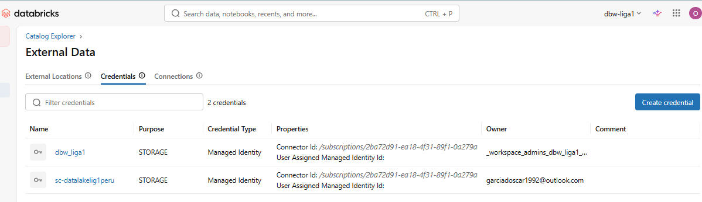
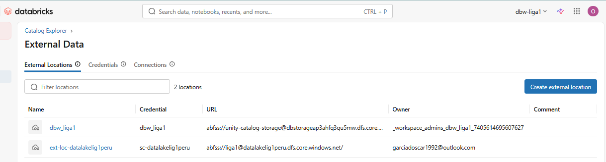

---

*Documentación técnica — Liga 1 Perú Data Engineering Platform · Oscar García Del Águila · 2025–2026*
