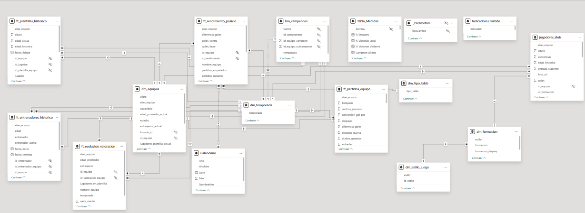
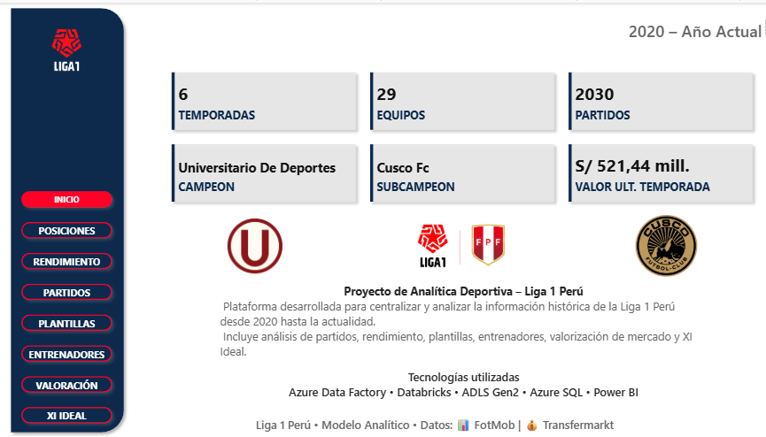
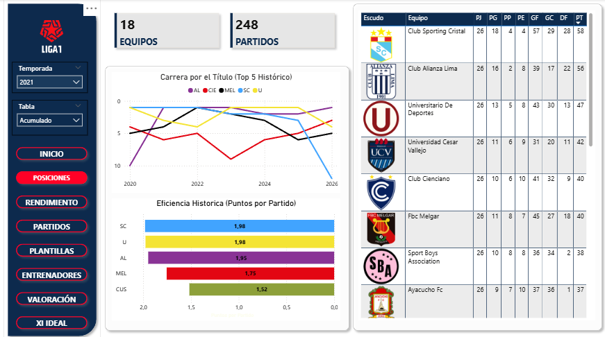
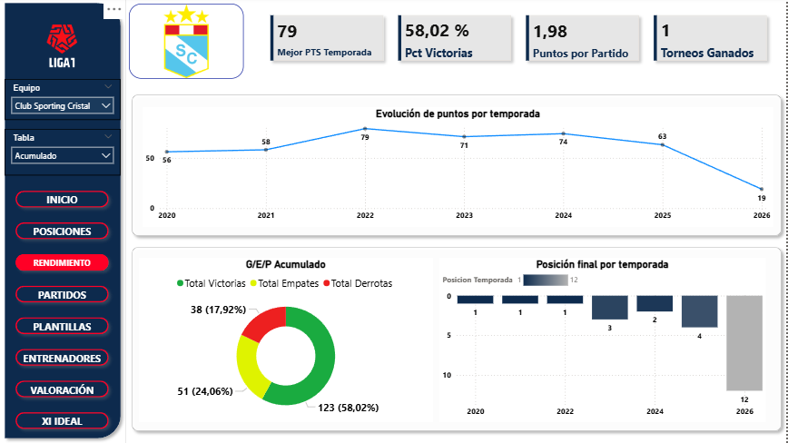
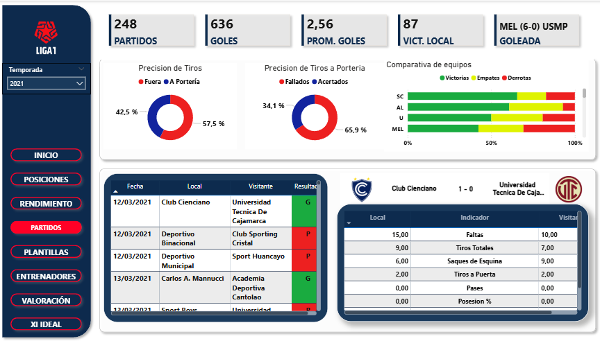
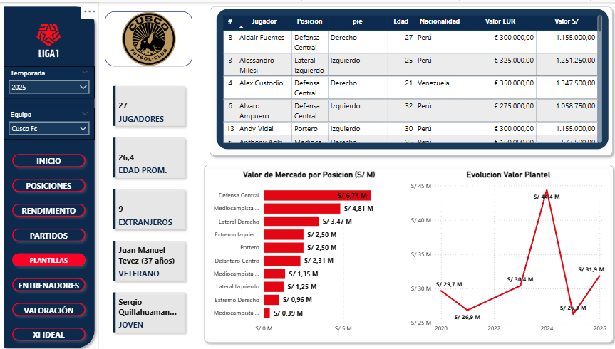
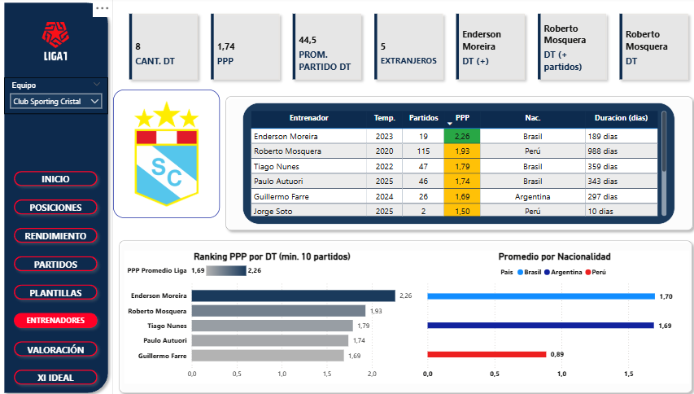
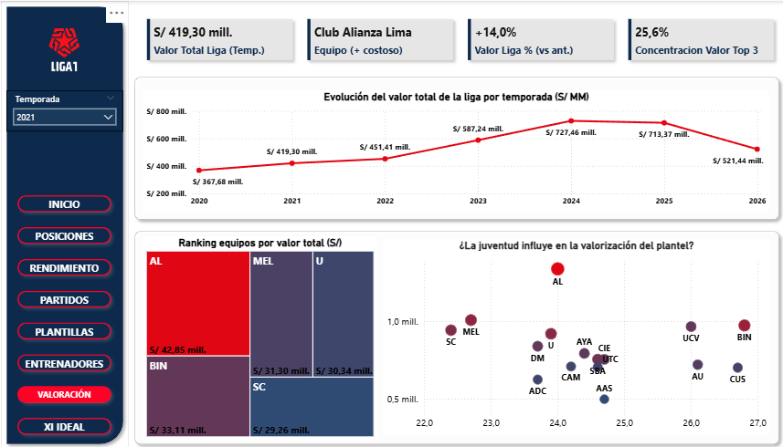
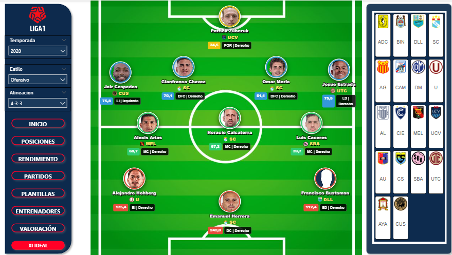

# Power BI — Liga 1 Perú

**Proyecto:** Liga 1 Perú — Data Engineering en Azure  
**Autor:** Oscar García Del Águila  
**Fecha:** Junio 2026

---

## Modelo Semántico

El SemanticModel se conecta a **Databricks SQL Warehouse** (`dbw-liga1`) en modo **Import** sobre el schema `catalog_liga1.vw_ddv`. Contiene 16 tablas y 107 medidas DAX.

### Tablas del modelo

| Tabla | Fuente DDV | Tipo |
|---|---|---|
| `dm_equipos` | `vw_ddv.dm_equipos_vw` | Dimensión |
| `dm_estilo_juego` | `vw_ddv.dm_estilo_juego` | Dimensión |
| `dm_formacion` | `vw_ddv.dm_formacion_slots` | Dimensión |
| `dm_temporada` | `vw_ddv.dm_temporada_vw` | Dimensión |
| `dm_tipo_tabla` | `vw_ddv.dm_tipo_tabla_vw` | Dimensión |
| `ft_entrenadores_historico` | `vw_ddv.ft_entrenadores_historico_vw` | Hecho |
| `ft_evolucion_valoracion` | `vw_ddv.ft_evolucion_valoracion_vw` | Hecho |
| `ft_partidos_equipo` | `vw_ddv.ft_partidos_equipo_vw` | Hecho |
| `ft_plantillas_historico` | `vw_ddv.ft_plantillas_historico_vw` | Hecho |
| `ft_rendimiento_posiciones` | `vw_ddv.ft_rendimiento_posiciones_vw` | Hecho |
| `hm_campeones` | `vw_ddv.hm_campeones_vw` | Hecho |
| `jugadores_slots` | `vw_ddv.vw_jugadores_slots` | XI Ideal |
| `Tabla_Medidas` | — | Medidas DAX |
| `_Parametros` | — | Tipo de cambio EUR/PEN editable |
| `Indicadores Partido` | — | Soporte PARTIDOS |
| `Calendario` | — | Dimensión fecha |

El parámetro `TipoCambioEURPEN` en `_Parametros` permite convertir valoraciones de Transfermarkt de EUR a soles peruanos sin modificar el modelo.

---

## Medidas DAX

El modelo tiene **107 medidas** definidas en la tabla virtual `Tabla_Medidas`. Las principales:

| Medida | Descripción |
|---|---|
| `Total Temporadas` | Temporadas distintas con registro |
| `Total Partidos` | Total de partidos en el modelo |
| `Total Equipos` | Equipos únicos |
| `Campeon Ultimo` | Campeón de la última temporada registrada |
| `Valor Total Plantel PEN` | Valor total del plantel en soles peruanos |
| `Valor Total Plantel MM PEN` | Valor total en millones PEN (última temporada) |
| `Valor Promedio Jugador PEN` | Valor promedio por jugador en PEN |
| `XI Ideal Campo` | HTML del campo de fútbol con la alineación calculada |

---

## Los 8 Dashboards

### INICIO — Hub de navegación

KPIs globales (temporadas, partidos, equipos, último campeón, valor de plantel) y botones de navegación a cada sección.

---

### POSICIONES — Tabla histórica

Clasificaciones Apertura, Clausura y General filtradas por temporada. Fuente: `ft_rendimiento_temporada`.

---

### RENDIMIENTO — Análisis por equipo

Evolución histórica de PJ, PG, PE, PP, GF y GC por equipo y temporada. Fuente: `ft_rendimiento_acumulado` y `ft_rendimiento_temporada`.

---

### PARTIDOS — Estadísticas detalladas

Exploración de 2030+ partidos con 80 métricas: posesión, tiros, pases, duelos, tarjetas. Fuente: `ft_partidos_detalle` (FotMob).

---

### PLANTILLAS — Evolución de planteles

Jugadores por equipo y temporada: posiciones, edades, extranjeros, valor de mercado. Fuente: `ft_plantillas_historico` (Transfermarkt).

---

### ENTRENADORES — Cuerpos técnicos

Historial de entrenadores por equipo: período en el cargo, temporadas dirigidas y resultados. Fuente: `ft_entrenadores_historico`.

---

### VALORACIÓN — Mercado de pases

Evolución del valor de plantel en EUR y PEN (tipo de cambio editable). Comparativa entre equipos y temporadas. Fuente: `ft_evolucion_valoracion`.

---

### XI IDEAL — Alineación óptima

Selecciona algorítmicamente al mejor jugador por posición táctica según temporada, formación y estilo de juego (Ofensivo / Equilibrado / Defensivo). El score es una suma ponderada de producción ofensiva, presencia, rendimiento del equipo (PPP) y penalizaciones disciplinarias, con pesos distintos por posición. El campo se renderiza en HTML con tooltips interactivos por jugador.

La vista `vw_jugadores_slots` calcula el ranking y es deployada manualmente desde `PrepAmb/ddl_deploy/` — no forma parte del pipeline E2E de ADF.

---

*Documentación Power BI — Liga 1 Perú Data Engineering Platform · Oscar García Del Águila · 2025–2026*
