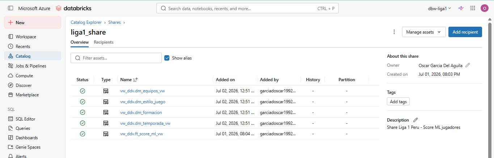
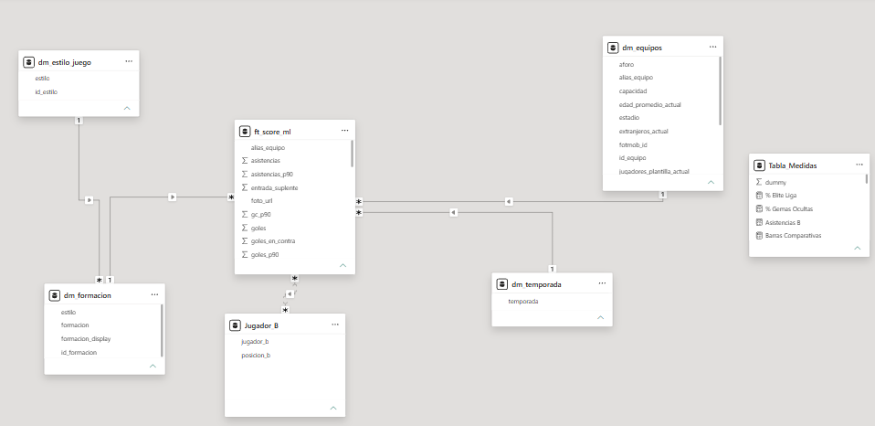

# Scouting ML — Liga 1 Perú

**Proyecto:** Liga 1 Perú — Data Engineering en Azure  
**Autor:** Oscar García Del Águila  
**Fecha:** Julio 2026

Documentación del módulo de Machine Learning para scoring de jugadores y del dashboard Power BI Scouting ML.

---

## Tabla de Contenidos

- [Modelo ML — ft_score_ml](#modelo-ml--ft_score_ml)
- [Delta Sharing — Exposición a Power BI](#delta-sharing--exposición-a-power-bi)
- [Power BI Scouting ML — Semantic Model](#power-bi-scouting-ml--semantic-model)
- [Página RESUMEN](#página-resumen)
- [Página XI IDEAL ML](#página-xi-ideal-ml)
- [Página PERFIL ML](#página-perfil-ml)
- [Medidas DAX clave](#medidas-dax-clave)
- [Tablas calculadas](#tablas-calculadas)

---

## Modelo ML — ft_score_ml

### Objetivo

Asignar a cada jugador de Liga 1 un **score normalizado (0-100)** que refleje su rendimiento global dentro de su posición, y clasificarlo en uno de cuatro niveles: Elite, Bueno, Regular o Suplente.

### Fuente de datos

- **Entrada:** `ft_estadisticas_jugadores` y `ft_plantillas_historico` (DDV)
- **Salida:** `catalog_liga1.tb_ddv.ft_score_ml` — score y nivel por jugador × temporada
- **Notebooks:** `proceso/frm_ml/notebooks/ft_score_ml/nb_ft_score_ml.py` + `ft_score_ml.py`
- **Ejecución:** Automática — integrada en el pipeline ADF E2E (`pl_Orchestrator_E2E_liga1`) tras la capa DDV, via `pl_Orchestrator_ligaperuana_ml` → Databricks Job `sch_ml_liga1`

### Conceptos clave del modelo

**PCA (Análisis de Componentes Principales):** técnica que toma múltiples estadísticas de un jugador (goles, asistencias, minutos, PPP, tarjetas, etc.) y las combina en un único número que resume su rendimiento global. En vez de comparar jugadores stat por stat, el modelo encuentra automáticamente qué combinación de stats distingue mejor a los jugadores dentro de cada posición.

**K-means (clasificación automática):** algoritmo que agrupa a los jugadores en 4 niveles según su score, sin que nadie defina manualmente los umbrales. El modelo decide dónde están las fronteras entre Elite, Bueno, Regular y Suplente basándose en la distribución real de los datos.

**Gemas ocultas:** jugadores con score Elite o Bueno pero con pocos minutos jugados — alto rendimiento cuando juegan, pero poca participación. Son candidatos a ser titulares o ser fichados antes de que su valor sea evidente.

### Pipeline ML

```
ft_estadisticas_jugadores + ft_plantillas_historico (DDV)
        │  ADF E2E → pl_Orchestrator_ligaperuana_ml → sch_ml_liga1
        │  nb_ft_score_ml.py + ft_score_ml.py
        ▼
   Stats por posición     ← Se aplican features distintas por posición (ver YAML conf)
                             Para POR: imbatidos, GC/90; para outfield: goles, asistencias
        │
        ▼  PCA (n_components=1) por posicion_xi
   score_ml (PC1)         ← Score bruto centrado en 0 por posición
        │
        ▼  Normalización MinMax dentro de posicion_xi → rango 0-100
   score_100              ← Score final (0=peor en su posición, 100=mejor)
        │
        ▼  K-means (k=4) sobre score_100 por posicion_xi
   nivel_num / nivel      ← 0=Suplente · 1=Regular · 2=Bueno · 3=Elite
        │
        ▼  Escritura Delta overwrite por temporada
   ft_score_ml            ← 9,651 filas · 774 jugadores únicos · 10 posiciones
```

### Variables por tipo de jugador

| Posición | Variables ML |
|---|---|
| **Outfield** (DC, EI, ED, MCO, MC, MCD, DFC, LD, LI) | goles_p90, asistencias_p90, participacion_p90, ppp, minutos_jugados, amarillas_p90 (neg), rojas_p90 (neg) |
| **POR** | partidos_imbatido, gc_p90 (invertido), ppp, minutos_jugados, amarillas_p90 (neg), rojas_p90 (neg) |

### Notas del modelo

- El PCA se entrena **por separado para cada `posicion_xi`** — los scores son comparables solo dentro de la misma posición, no entre posiciones distintas.
- `var_explicada` indica cuánta varianza del conjunto de stats captura PC1 para esa posición — cuanto mayor, más representativo es el score.
- La tabla tiene **9,651 filas** porque multiplica jugadores × temporadas × slots de formación (un jugador puede aparecer en múltiples slots si el modelo lo ubica en distintas posiciones). Para contar jugadores únicos usar `DISTINCTCOUNT(jugador)` → 774.
- El umbral mínimo de **300 minutos** filtra jugadores sin participación suficiente para que el modelo sea representativo.

---

## Delta Sharing — Exposición a Power BI

`ft_score_ml` se expone al Power BI Scouting ML sin modo Import clásico — mediante **Delta Sharing de Unity Catalog**, que permite compartir datos Delta Lake directamente sin copiarlos fuera de Databricks.

### Configuración

Script: `PrepAmb/PrepAmb/ddl_deploy/nb_delta_sharing.py`

| Elemento | Valor |
|---|---|
| Share | `liga1_scouting` |
| Tabla compartida | `catalog_liga1.vw_ddv.ft_score_ml_vw` |
| Recipient | configurado en Unity Catalog → credential file descargado |
| Conector Power BI | Delta Sharing (Power BI Connector for Databricks) |

### Flujo de conexión

1. En Unity Catalog: crear share `liga1_scouting` → agregar tabla `ft_score_ml_vw` → crear recipient → descargar credential file (`.share`)
2. En Power BI Desktop: Obtener datos → Delta Sharing → cargar el `.share` → seleccionar `ft_score_ml_vw`
3. Power BI importa los datos al SemanticModel en modo Import

El share se actualiza automáticamente cuando se regenera `ft_score_ml` — no requiere reconfiguración en Power BI.



---

## Power BI Scouting ML — Semantic Model

**Archivo:** `dashboard/Liga 1 Perú - Scouting ML.pbix`  
**Conexión:** Delta Sharing → `ft_score_ml_vw`  
**Modo:** Import



### Tablas del modelo

| Tabla | Tipo | Origen | Descripción |
|---|---|---|---|
| `ft_score_ml` | Hecho | Delta Sharing (`ft_score_ml_vw`) | Tabla principal: score, nivel, stats por jugador × temporada |
| `Jugador_B` | Calculada | DAX sobre `ft_score_ml` | Tabla desconectada para selección independiente del segundo jugador en PERFIL ML |
| `Radar_Categorias` | Calculada | DAX (DATATABLE) | Categorías del radar de atributos para jugadores outfield |
| `Tabla_Medidas` | Virtual | — | Contenedor de todas las medidas DAX del modelo |

### Relaciones

| Desde | Hacia | Tipo | Dirección |
|---|---|---|---|
| `ft_score_ml[posicion_xi]` | `Jugador_B[posicion_b]` | Many-to-many | Simple (ft_score_ml → Jugador_B) |

La relación entre `ft_score_ml` y `Jugador_B` es de dirección única para que el slicer de posición filtre las opciones disponibles del Jugador B sin afectar al Jugador A.

---

## Página RESUMEN

Vista general del modelo ML. Permite entender de un vistazo cuántos jugadores tiene la liga, cómo se distribuyen por nivel de rendimiento, quiénes destacan sin ser titulares (gemas ocultas), qué titulares rinden por debajo de lo esperado, y cómo ha evolucionado el nivel promedio de la liga temporada a temporada.

**Gemas ocultas:** jugadores clasificados como Elite o Bueno por el modelo pero con pocos minutos acumulados. Alto rendimiento cuando juegan, pero poca participación — candidatos a ser potenciados o fichados antes de que su valor sea visible.

**Titulares Bajo Score:** jugadores con alta acumulación de minutos pero score bajo — están jugando mucho pero el modelo indica que su rendimiento es por debajo del nivel esperado para su posición.

No tiene filtros de página — muestra el panorama global de todas las temporadas y posiciones.


---

## Página XI IDEAL ML

Muestra el mejor equipo posible según el modelo ML para la temporada, formación y estilo de juego seleccionados. El campo de fútbol renderiza a cada jugador en su posición con su foto, nombre, equipo, score y nivel. Un overlay muestra el score promedio del XI completo. El modelo selecciona automáticamente al jugador con mayor score en cada slot de la formación elegida.

### Filtros de página

- Temporada
- Estilo de juego: Ofensivo · Equilibrado · Defensivo
- Formación: 4-3-3 · 4-4-2 · etc.


---

## Página PERFIL ML

Comparativa detallada entre dos jugadores de la misma posición. El usuario selecciona la posición primero (que filtra las opciones de ambos jugadores), luego elige al Jugador A y al Jugador B de forma independiente. La página muestra cuatro secciones: un header con foto, equipo y score de cada jugador; barras comparativas de sus estadísticas principales; un radar de cinco atributos normalizados; y la evolución histórica del score de ambos a lo largo de las temporadas.

El **Jugador B** se selecciona desde una tabla desconectada (`Jugador_B`) para que su elección no afecte el contexto del Jugador A ni los demás visuals de la página.

### Filtros de página

- Temporada
- Posición (filtra ambos jugadores)
- Jugador A
- Jugador B


---

## Medidas DAX clave

Todas las medidas viven en `Tabla_Medidas`.

### Medidas de Jugador A

```dax
Score ML      = MIN(ft_score_ml[score_100])
Goles A       = MIN(ft_score_ml[goles])
Asistencias A = MIN(ft_score_ml[asistencias])
Minutos A     = MIN(ft_score_ml[minutos_jugados])
Partidos A    = MIN(ft_score_ml[partidos_jugados])
PPP A         = MIN(ft_score_ml[ppp])
Nivel A       = MIN(ft_score_ml[nivel])
Posicion A    = MIN(ft_score_ml[posicion_xi])
```

> Se usa `MIN()` en lugar de `SUM()` porque la tabla tiene filas multiplicadas por slots de formación. `MIN()` devuelve el valor real del jugador en ese contexto.

### Medidas de Jugador B

Todas usan el patrón `REMOVEFILTERS(ft_score_ml[jugador])` + filtro por `SELECTEDVALUE(Jugador_B[jugador_b])`:

```dax
Score B = 
CALCULATE(
    MIN(ft_score_ml[score_100]),
    REMOVEFILTERS(ft_score_ml[jugador]),
    ft_score_ml[jugador] = SELECTEDVALUE(Jugador_B[jugador_b])
)
-- El mismo patrón aplica para Goles B, Asistencias B, Minutos B, PPP B, Posicion B, etc.
```

### Medidas para Radar

```dax
-- Normalización para Radar (valores 0-1)
Radar Score ML      = DIVIDE([Score ML], 100)
Radar Goles90       = DIVIDE(MIN(ft_score_ml[goles_p90]), 1.65)    -- máx referencia Liga 1
Radar Asist90       = DIVIDE(MIN(ft_score_ml[asistencias_p90]), 0.92)
Radar PPP           = DIVIDE(MIN(ft_score_ml[ppp]), 3.0)
Radar Min Jugados   = DIVIDE(MIN(ft_score_ml[minutos_jugados]), 3240)
Radar GC90 Inv      = DIVIDE(MIN(ft_score_ml[gc_p90]) * -1, 3.0)  -- solo POR, invertido

-- SWITCH sobre Radar_Categorias — adapta valores según posición
Radar Valor A = 
VAR pos = MIN(ft_score_ml[posicion_xi])
RETURN
SWITCH(SELECTEDVALUE(Radar_Categorias[Atributo]),
    "Score ML",       [Radar Score ML],
    "Goles / P.Imb",  IF(pos="POR", DIVIDE(MIN(ft_score_ml[partidos_imbatido]), 10), [Radar Goles90]),
    "Asist / GC Ev.", IF(pos="POR", [Radar GC90 Inv], [Radar Asist90]),
    "PPP",            [Radar PPP],
    "Minutos",        [Radar Min Jugados]
)
-- Radar Valor B sigue el mismo patrón con medidas B y [Posicion B]
```

---

## Tablas calculadas

### Jugador_B

Tabla desconectada que permite seleccionar un segundo jugador sin afectar el contexto del Jugador A.

```dax
Jugador_B = 
DISTINCT(
    SELECTCOLUMNS(
        ft_score_ml,
        "jugador_b",  ft_score_ml[jugador],
        "posicion_b", ft_score_ml[posicion_xi]
    )
)
```

Relación: `ft_score_ml[posicion_xi]` → `Jugador_B[posicion_b]` (dirección simple). Permite que el slicer de posición filtre las opciones del Jugador B sin crear circularidad.

### Radar_Categorias

Tabla estática con las etiquetas de los ejes del radar. Las etiquetas son híbridas para funcionar con cualquier posición — los valores cambian vía SWITCH en las medidas.

```dax
Radar_Categorias = DATATABLE("Atributo", STRING, 
    {{"Score ML"}, {"Gol

### Radar_Categorias

Tabla estática con las etiquetas de los ejes del radar. Las etiquetas son híbridas para funcionar con cualquier posición — los valores cambian vía SWITCH en las medidas.

```dax
Radar_Categorias = DATATABLE("Atributo", STRING,
    {{"Score ML"}, {"Goles"}, {"Asistencias"}, {"Minutos"}, {"PPP"}}
)
```

---

## 5. Flujo de actualización

1. El notebook  corre manualmente o vía job 
2. Escribe en  (Delta Lake)
3. Delta Sharing expone la tabla al recipient de Power BI
4. En Power BI Desktop: **Actualizar** refresca todos los visuales con los nuevos scores

---

*Documentación Scouting ML — Liga 1 Perú Data Engineering Platform · Oscar García Del Águila · 2025–2026*
