# 06 · Módulo IA — Asistente RAG Liga 1 Perú

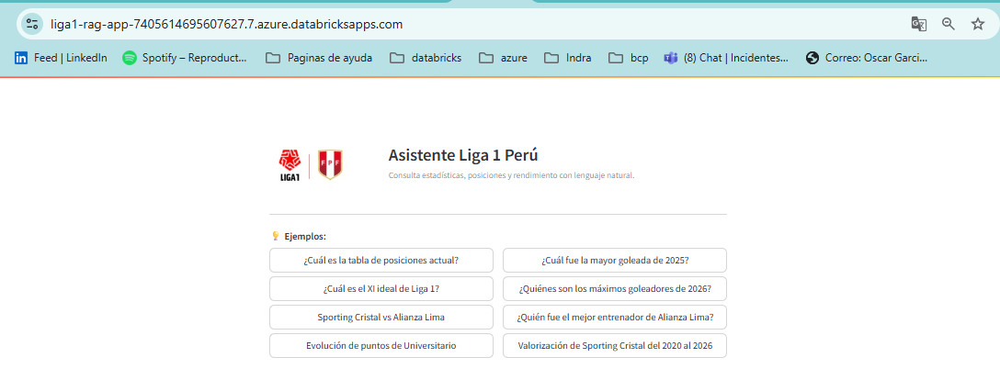

---

## ¿Qué es RAG?

**RAG (Retrieval-Augmented Generation)** combina dos componentes:

1. **Retrieval** (recuperación): consulta las tablas Delta de Liga 1 para obtener información actualizada.
2. **Generation** (generación): un LLM usa esos datos como contexto para generar una respuesta en lenguaje natural.

A diferencia de un chatbot convencional, el RAG **lee tus datos reales** antes de responder — las respuestas reflejan la temporada actual de la liga.

---

## Arquitectura

```
Usuario (pregunta en lenguaje natural)
         │
         ▼
┌─────────────────────┐
│   app.py            │  ← Streamlit UI (Databricks App)
│   Interfaz de chat  │
└────────┬────────────┘
         │
         ▼
┌─────────────────────┐
│   rag.py            │  ← Lógica RAG
│   1. Detectar tema  │
│   2. Query Delta    │
│   3. Armar contexto │
│   4. Llamar LLM     │
└────┬────────────────┘
     │              │
     ▼              ▼
┌─────────┐   ┌──────────────────┐
│Databricks│  │ Azure OpenAI     │
│SQL Delta │  │ gpt-5.4-mini     │
│ (tablas) │  │ aoai-liga1       │
└─────────┘   └──────────────────┘
```

---

## Recursos Azure creados

| Recurso | Nombre | Tipo | Región |
|---------|--------|------|--------|
| Azure OpenAI | `aoai-liga1` | OpenAI Standard S0 | East US |
| Model deployment | `gpt-5.4-mini` | Data Zone Standard | US Data Zone |

> El recurso `aoai-liga1` es **compartido entre dev y prod**. No se crea un segundo recurso para producción.

### Configuración del modelo

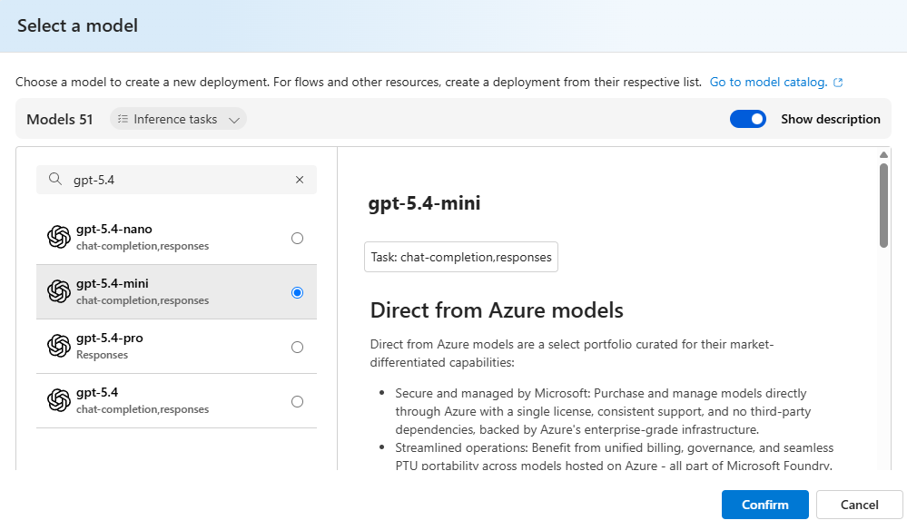

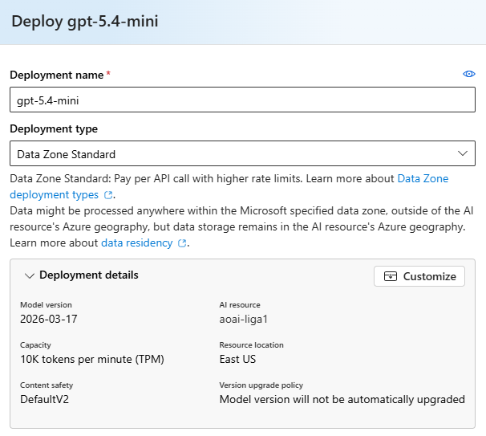

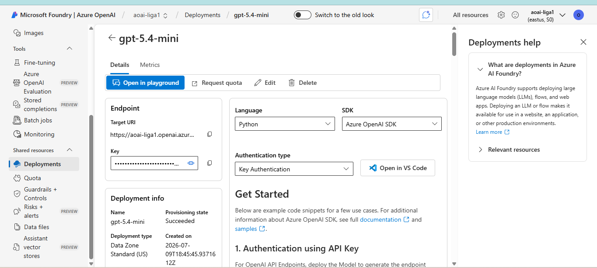

---

## Vistas Delta consultadas

El asistente consulta las siguientes vistas DDV según el tipo de pregunta detectado. Todas usan la capa `vw_ddv` (Gold enriquecida) con `nombre_equipo` ya resuelto — sin JOINs adicionales.

| Vista | ¿Cuándo se consulta? |
|-------|----------------------|
| `vw_ddv.ft_rendimiento_posiciones_vw` | Tabla de posiciones, rendimiento por temporada y `tipo_tabla` |
| `vw_ddv.ft_estadisticas_jugadores_vw` | Goles, asistencias y estadísticas reales de partido |
| `vw_ddv.ft_partidos_equipo_vw` | Partidos disputados, resultado, posesión, tarjetas |
| `vw_ddv.ft_plantillas_historico_vw` | Plantilla de un equipo (jugadores, posición, valor de mercado) |
| `vw_ddv.ft_evolucion_valoracion_vw` | Evolución del valor de mercado de equipos (2020–2026) |
| `vw_ddv.ft_partidos_detalle_vw` | Pases, duelos, entradas, regates por partido (cobertura ~94% en 2026) |
| `vw_ddv.ft_score_ml_vw` | Score ML de rendimiento de jugadores calculado por el modelo |
| `vw_ddv.dm_equipos_vw` | Carga dinámica de equipos y alias en runtime |
| `vw_ddv.dm_formacion` | Formaciones tácticas para XI ideal (4-3-3, 4-4-2, etc.) |
| `vw_ddv.dm_estilo_juego` | Estilos de juego para XI ideal (ofensivo, defensivo, equilibrado) |
| `vw_ddv.dm_temporada_vw` | Dimensión temporada (año activo, fases disponibles) |

> **`tipo_tabla`:** valores en DB son Title Case (`Apertura`, `Clausura`, `Clausura - Grupo A`…). Las queries usan `lower(tipo_tabla) LIKE lower('%clausura%')`.

> **Nombres de equipo:** almacenados en minúsculas (`club alianza lima`). El RAG trabaja con los valores tal como están en la DB.

---

## Estructura de archivos

```
databricks_app/
├── app.yaml          # Configuración Databricks App (comando de arranque)
├── app.py            # Streamlit UI — interfaz de chat
├── rag.py            # Lógica RAG — routing + queries + LLM
└── requirements.txt  # Dependencias Python
```

`app.yaml` indica a Databricks cómo arrancar el servidor:

```yaml
command:
  - streamlit
  - run
  - app.py
  - --server.port=8000
  - --server.address=0.0.0.0
  - --server.headless=true
```

---

## Variables de entorno y secrets

`app.yaml` solo contiene los 3 valores de Azure OpenAI (iguales en dev y prod). Los valores específicos de cada entorno se leen automáticamente desde el scope `secretliga1` del workspace donde corre la app — el mismo código funciona en dev y prod sin cambios en el archivo.

| Variable en `app.yaml` | Valor | Sensible |
|------------------------|-------|----------|
| `AOAI_ENDPOINT` | `https://aoai-liga1.openai.azure.com/` | No |
| `AOAI_DEPLOYMENT` | `gpt-5.4-mini` | No |
| `AOAI_API_VERSION` | `2025-01-01-preview` | No |

Los siguientes valores vienen del scope `secretliga1` de Databricks (cada workspace tiene los suyos):

| Secret en `secretliga1` | Dev | Prod |
|-------------------------|-----|------|
| `aoai-api-key` | key de aoai-liga1 | misma key |
| `rag-databricks-token` | PAT dev scope SQL | PAT prod scope SQL |
| `catalogname` | `catalog_liga1` | `catalog_liga1_prod` |
| `databricks-http-path` | `/sql/1.0/warehouses/b74f62ff6067bdf7` | `/sql/1.0/warehouses/8f3fbabc301b89f4` |

`DATABRICKS_HOST` lo inyecta Databricks automáticamente al correr como App — no se configura manualmente.

### Cómo se leen los secrets

`rag.py` usa el **Databricks SDK** con M2M OAuth (credenciales inyectadas automáticamente por Databricks Apps):

```python
from databricks.sdk import WorkspaceClient
w = WorkspaceClient()  # usa DATABRICKS_CLIENT_ID + CLIENT_SECRET auto-inyectados
result = w.secrets.get_secret(scope="secretliga1", key="aoai-api-key")
```

---

## Capacidades del asistente

### Evolución de rendimiento de equipo

Análisis histórico del rendimiento de un equipo temporada a temporada: puntos, posición final, variación.

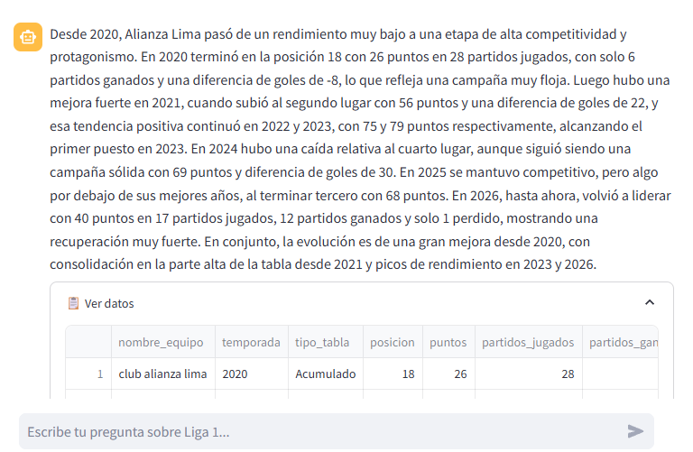

---

### Dominio histórico y eficiencia

Comparación global de todos los equipos: quién ha dominado más la liga, puntos por partido, consistencia entre temporadas.

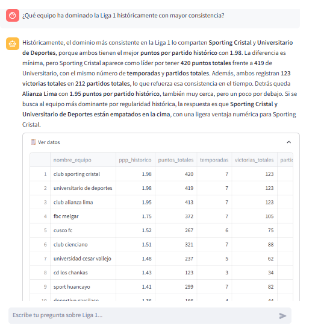

---

### Valor de mercado — evolución por equipo

Evolución del valor de mercado de un equipo específico temporada a temporada.

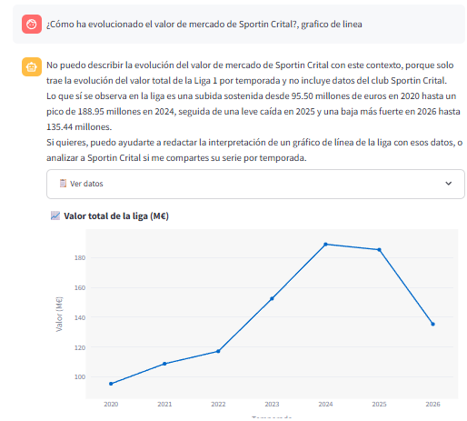

### Valor de mercado — comparación global de la liga

Vista panorámica del valor de mercado de todos los equipos.

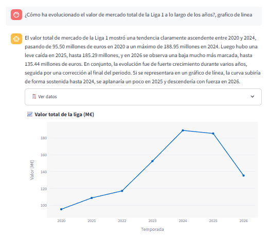

---

### VS Equipos

Comparación head-to-head: historial de enfrentamientos, posesión, tarjetas, goles, pases y duelos.

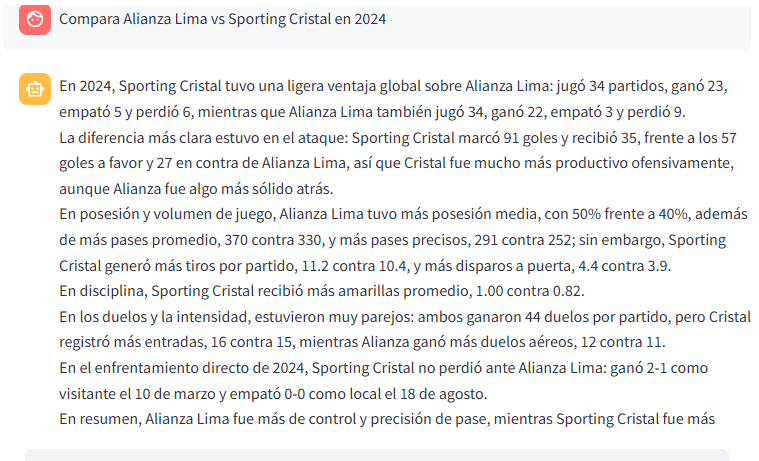

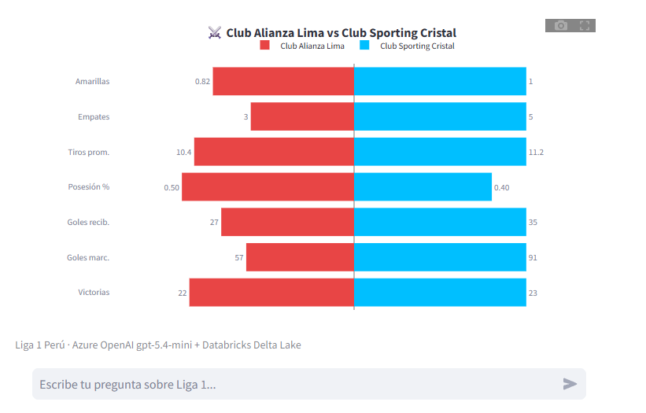

---

### VS Jugadores

Comparación directa entre dos jugadores: goles, asistencias, minutos, posición, equipo.

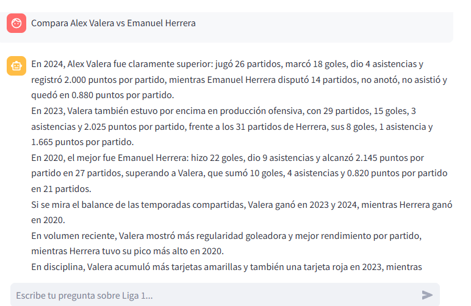

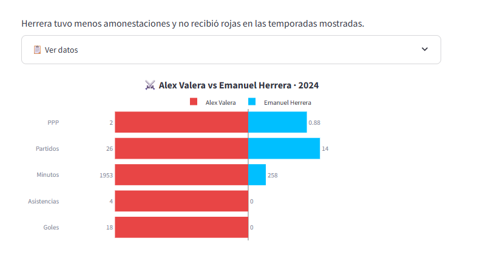

---

### VS Entrenadores

Comparación entre dos entrenadores: victorias, empates, derrotas, rendimiento por equipo.

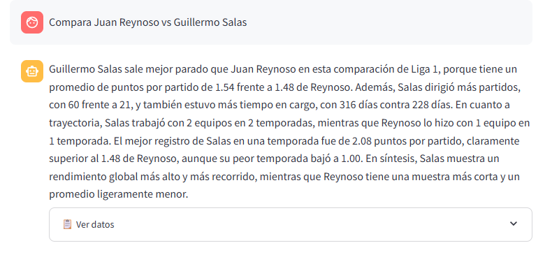

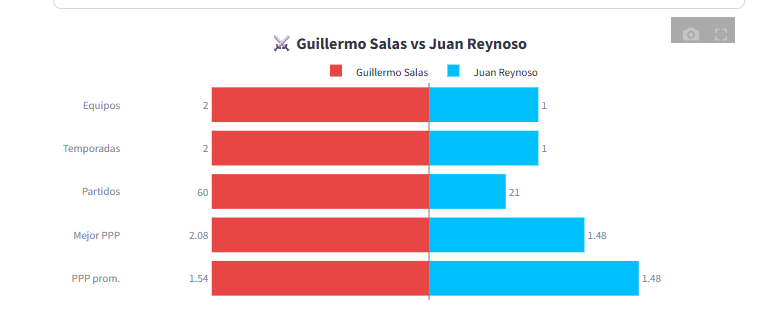

---

### Análisis de entrenadores

Historial completo de un entrenador: equipos dirigidos, temporadas, rendimiento.

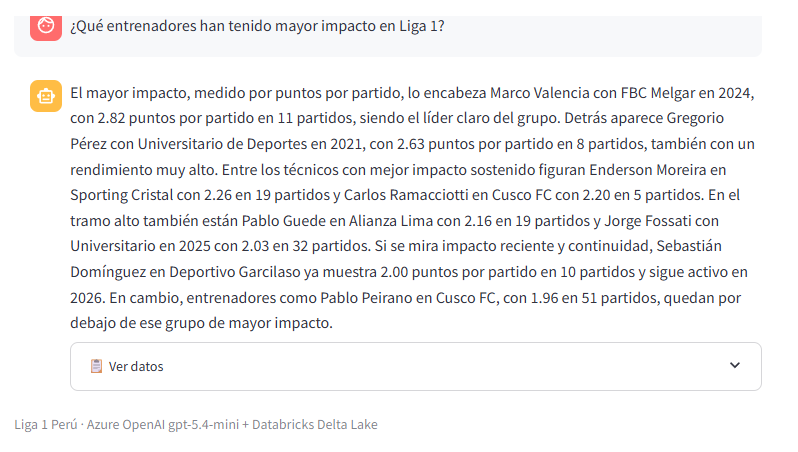

---

### XI Ideal — Perfil ofensivo

Once ideal con perfil ofensivo usando Score ML y criterios tácticos.

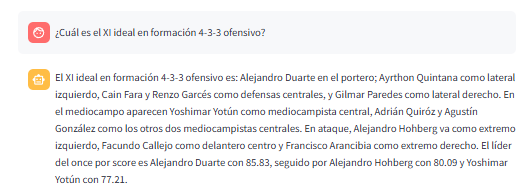

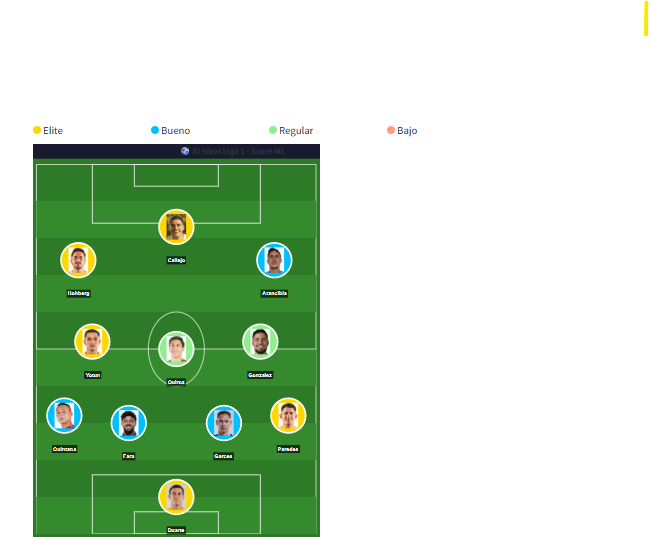

---

### XI Ideal — Perfil defensivo

Once ideal con perfil defensivo priorizado.

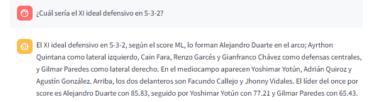

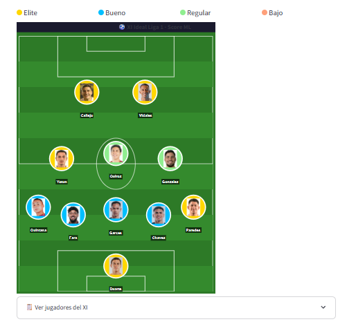

---

### Score ML — Top jugadores

Ranking de jugadores por Score ML (0–100) calculado por el modelo de Machine Learning.

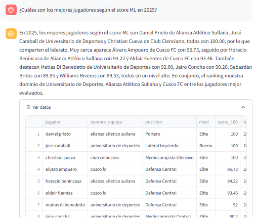

---

### Score ML — Por posición

Filtro por posición específica (portero, defensor, mediocampista, delantero).

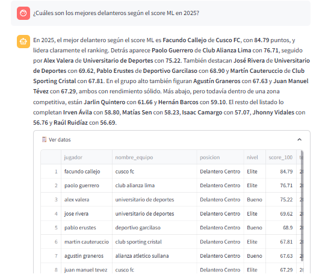

---

### Evolución Score ML de un jugador

Seguimiento del Score ML de un jugador a lo largo de las temporadas.

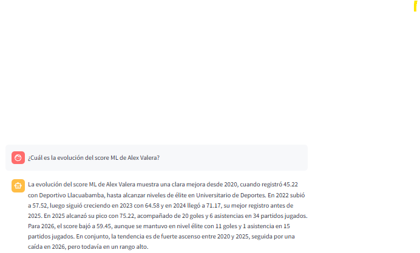

---

### Gemas ocultas

Jugadores con alto Score ML (≥65) pero pocos partidos jugados (≤12) — talento sub-expuesto.

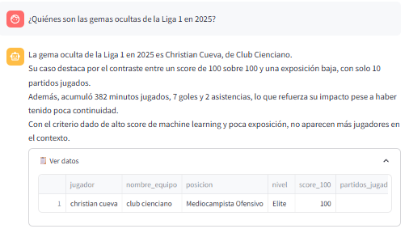

---

### Jugadores bajo rendimiento

Jugadores con muchos partidos (≥15) pero Score ML bajo (<50) — rendimiento por debajo de lo esperado.

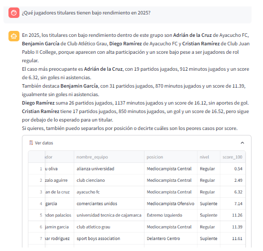

---

### Historia de partidos — Mayor goleada

Consultas históricas: mayor goleada, último enfrentamiento, racha sin perder.

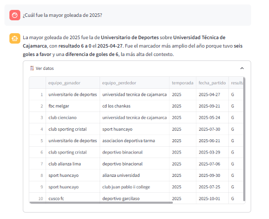

---

## Despliegue en Producción

El despliegue a producción está **completamente automatizado** via GitHub Actions. Al hacer push a `main` con cambios en `databricks_app/`, el workflow `liga1-deploy-prod.yml` ejecuta el **Job 6 — Deploy Databricks App** que:

1. Espera a que el Job 3 sincronice el repo en el workspace prod
2. Crea la app `liga1-ia` si no existe
3. Dispara el deployment apuntando a `/Workspace/Repos/{user}/liga1-azure/databricks_app`
4. Hace polling hasta confirmar estado `SUCCEEDED`
5. Imprime la URL pública de la app en el log de GitHub Actions

No se requieren pasos manuales en la UI de Databricks para producción.

### Requisito: PAT con scope `apps`

El GitHub Secret `DATABRICKS_TOKEN_PROD` debe ser un PAT con el scope **`apps`** habilitado. Para verificar o agregar el scope: workspace prod → **Settings → Developer → Access tokens** → editar el token → agregar `apps` en API scope(s).

### Secrets escritos automáticamente por el workflow

El Job 3 del workflow escribe en el scope `secretliga1` del workspace prod:

| Secret | Origen |
|--------|--------|
| `aoai-api-key` | GitHub Secret `AOAI_API_KEY` |
| `rag-databricks-token` | GitHub Secret `DATABRICKS_TOKEN_PROD` |
| `catalogname` | `catalog_liga1_prod` |
| `databricks-http-path` | `/sql/1.0/warehouses/8f3fbabc301b89f4` |

---

## Despliegue en Desarrollo (primera vez, manual)

1. En Databricks dev → **Apps** → **Create App** → **Custom app**
2. Nombre: `liga1-ia` · Source code: repo `liga1-azure` → carpeta `databricks_app/`
3. **Deploy** → esperar ~2 min
4. El scope `secretliga1` dev ya tiene los secrets necesarios

---

## Gestión de costos

| Componente | Detalle | Costo estimado |
|-----------|---------|----------------|
| Azure OpenAI `gpt-5.4-mini` | ~4K tokens/query | ~$0.003 por consulta |
| Databricks App (activa) | ~$0.07–$0.10/DBU·h solo cuando está Running | ~$1–2/mes uso moderado |
| SQL Warehouse | Ya activo para Power BI | $0 incremental |

**Clave para controlar costos:** detener la app cuando no se usa — **Apps** → `liga1-ia` → **Stop**. El warehouse serverless se auto-suspende a los 10 min sin queries.

---

## Detección dinámica de equipos

`rag.py` consulta `dm_equipos_vw` al arrancar para cargar nombres y alias de todos los equipos activos. El resultado se cachea en memoria durante la sesión. Si un equipo nuevo sube a Liga 1, la app lo detecta sin cambios en el código.

